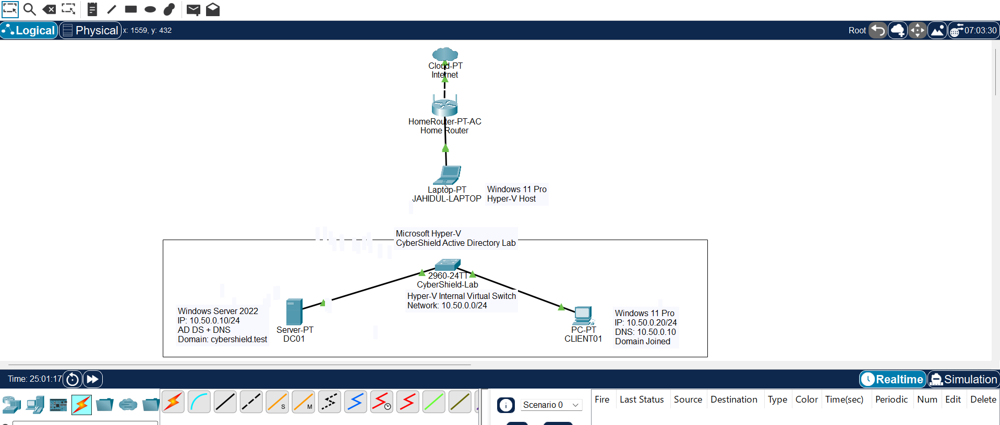

# CyberShield-Active-Directory-Lab
Enterprise-style Active Directory home lab built with Hyper-V and Windows Server 2022, demonstrating AD DS, DNS, OU design, security groups, AGDLP access control, Group Policy and Windows administration.
## Network Topology

The CyberShield lab is hosted on Microsoft Hyper-V and uses an isolated internal virtual network (`10.50.0.0/24`). The topology below documents how the virtual Active Directory environment relates to the physical Windows 11 host and home network.

### Lab Network

- **Hyper-V Host:** JAHIDUL-LAPTOP — Windows 11 Pro
- **Virtual Switch:** CyberShield-Lab — Hyper-V Internal Virtual Switch
- **Network:** `10.50.0.0/24`
- **DC01:** Windows Server 2022 — `10.50.0.10`
- **CLIENT01:** Windows 11 Pro — `10.50.0.20`
- **DNS Server:** `10.50.0.10`
- **Active Directory Domain:** `cybershield.test`

The editable Cisco Packet Tracer topology is also included in the repository:

[`CyberShield-Network-Topology.pkt`](docs/network-topology/CyberShield-Network-Topology.pkt)
