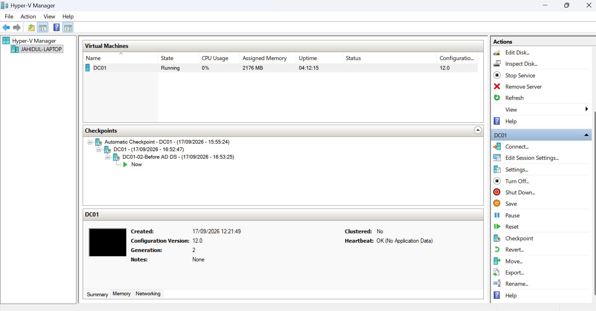
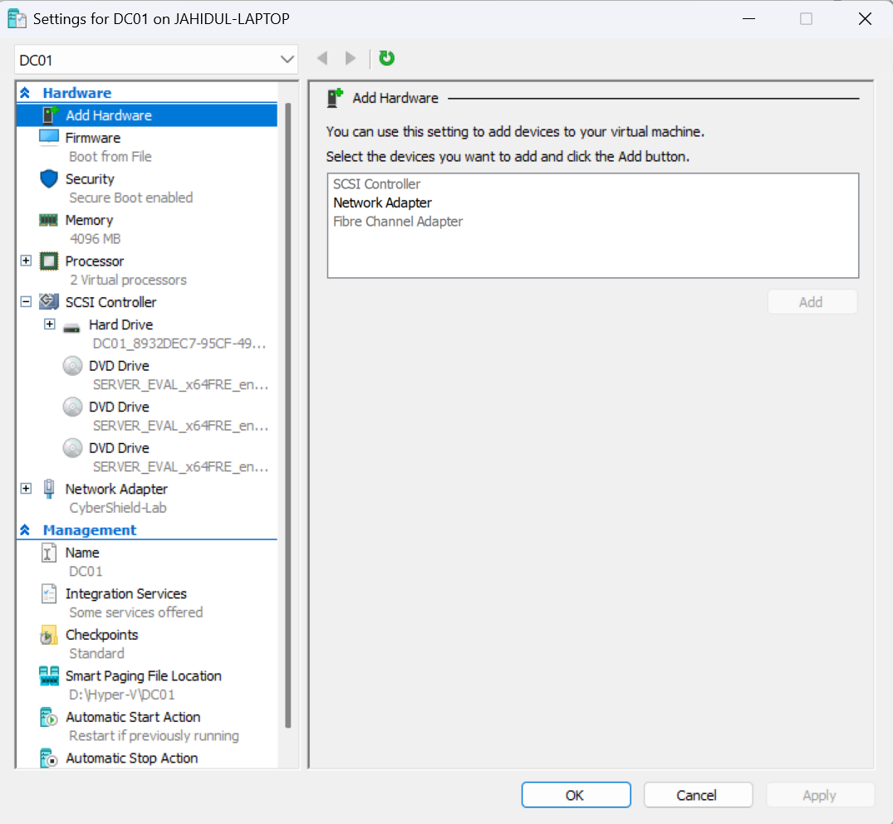
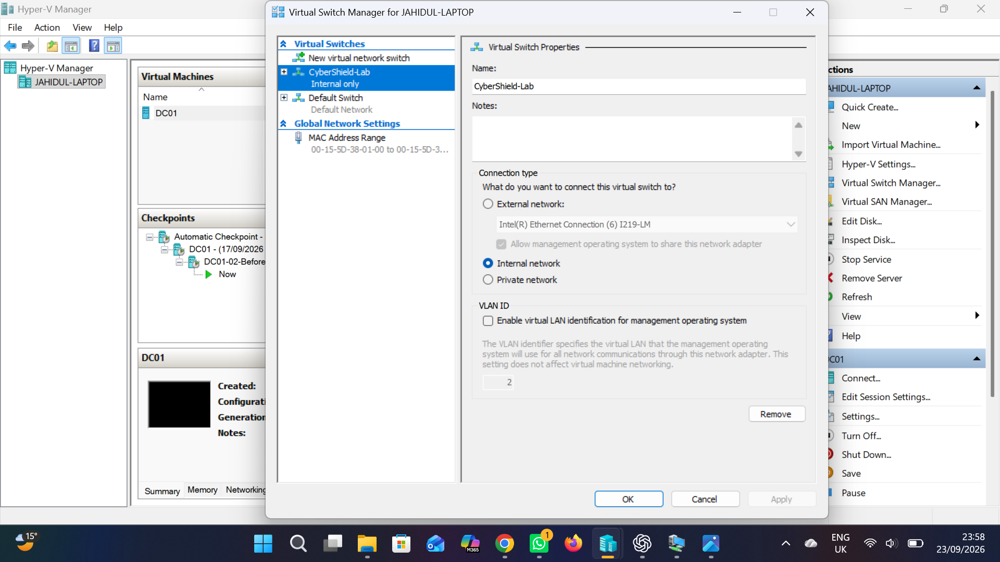
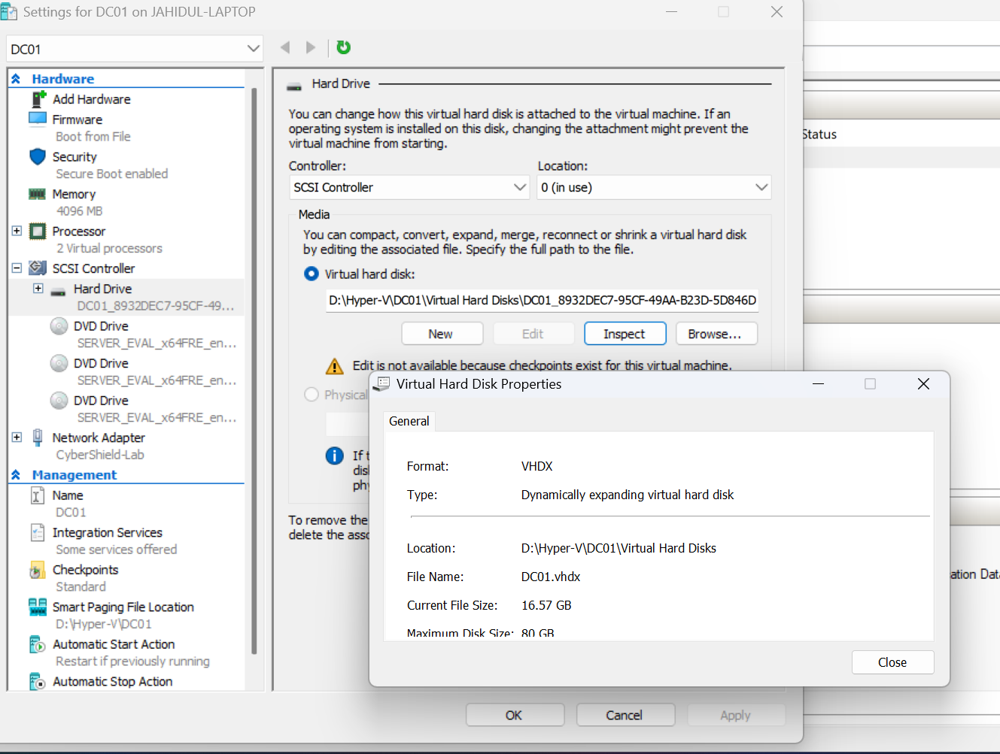

# 01 - Hyper-V Lab Setup

## Overview

The CyberShield Active Directory Lab is hosted in Microsoft Hyper-V on a Windows 11 Pro laptop. Hyper-V provides an isolated virtual environment where Windows Server, Active Directory, DNS, networking, Group Policy, and access-control configurations can be tested without affecting the physical host.

The first virtual machine created for the lab is **DC01**, which is used as the Windows Server domain controller for the `cybershield.test` domain.

---

## Hyper-V Virtual Machine

The DC01 virtual machine was created as a **Generation 2** Hyper-V VM.

### DC01 Configuration

| Component | Configuration |
|---|---|
| VM Name | DC01 |
| Generation | Generation 2 |
| Memory | 4096 MB |
| Virtual Processors | 2 |
| Virtual Disk | 80 GB VHDX |
| Disk Type | Dynamically Expanding |
| Virtual Switch | CyberShield-Lab |
| Switch Type | Internal Network |

The VM was allocated 4 GB of memory and 2 virtual processors, providing sufficient resources for a small Active Directory lab while keeping host resource usage reasonable.

*Hyper-V Manager showing the DC01 virtual machine and checkpoints used during the lab build.*

---

## Virtual Machine Hardware

DC01 was configured with virtual CPU, memory, storage, and networking resources through Hyper-V.

*Hyper-V hardware configuration for the DC01 virtual machine.*

---

## Virtual Network

A dedicated Hyper-V virtual switch named **CyberShield-Lab** was created using the **Internal Network** switch type.

This provides a controlled network for communication between the Hyper-V host and the lab virtual machines. It also keeps the Active Directory lab separated from the normal physical network while allowing additional client and server VMs to be connected later.

*CyberShield-Lab internal virtual switch used by the lab environment.*

---

## Virtual Storage

DC01 uses an **80 GB dynamically expanding VHDX** virtual disk.

A dynamically expanding disk was selected so that the VHDX file consumes physical storage as data is written rather than immediately reserving the entire 80 GB maximum capacity.

*DC01 dynamically expanding VHDX configuration.*

---

## Checkpoints

Hyper-V checkpoints were used during important stages of the build. This provides recovery points before significant configuration changes, such as installing and configuring Active Directory Domain Services.

Using checkpoints in the lab makes it possible to test configurations and recover quickly if a change causes problems.

> **Note:** Hyper-V checkpoints are useful for this training lab but should not be treated as a replacement for a proper server backup strategy.

---

## Outcome

At this stage, the Hyper-V infrastructure provides the virtualisation foundation for the CyberShield lab. DC01 has dedicated compute, storage, and networking resources and is ready to provide Active Directory Domain Services and DNS for the environment.
