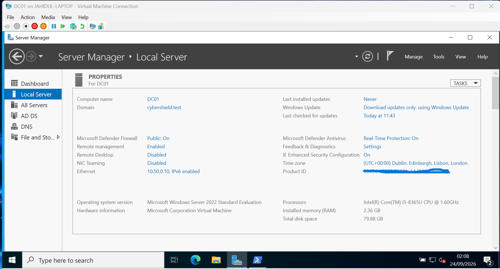
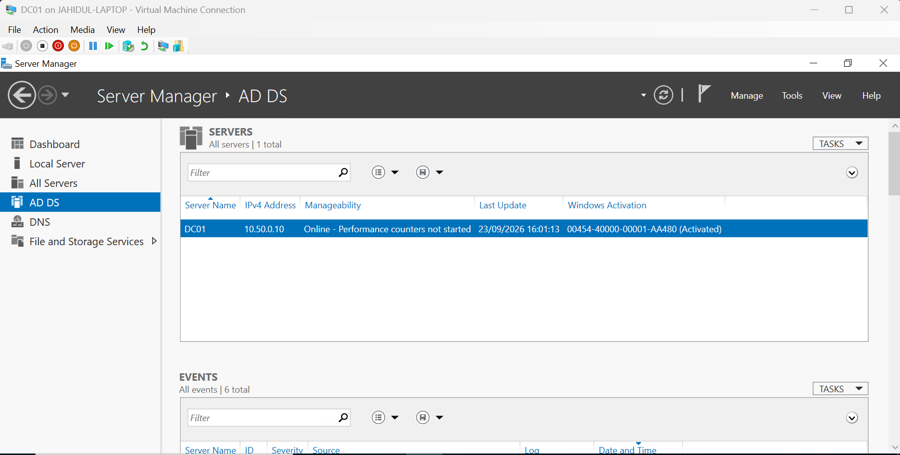
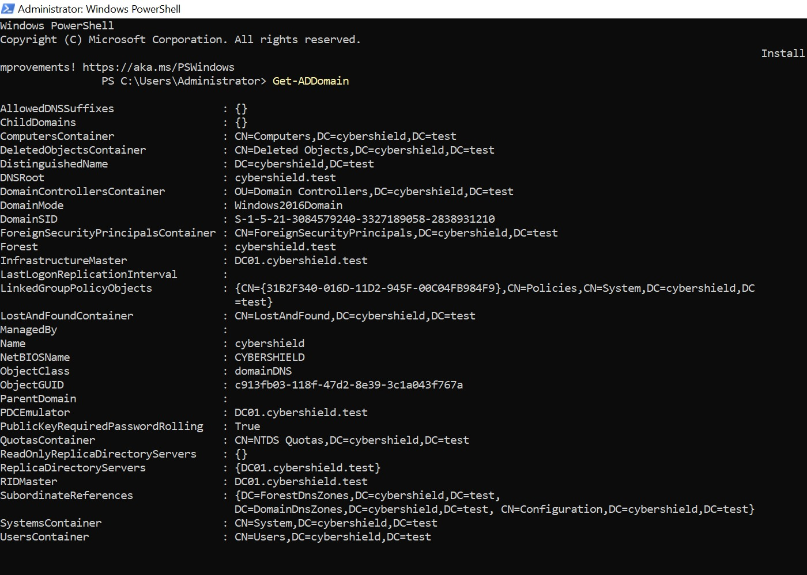
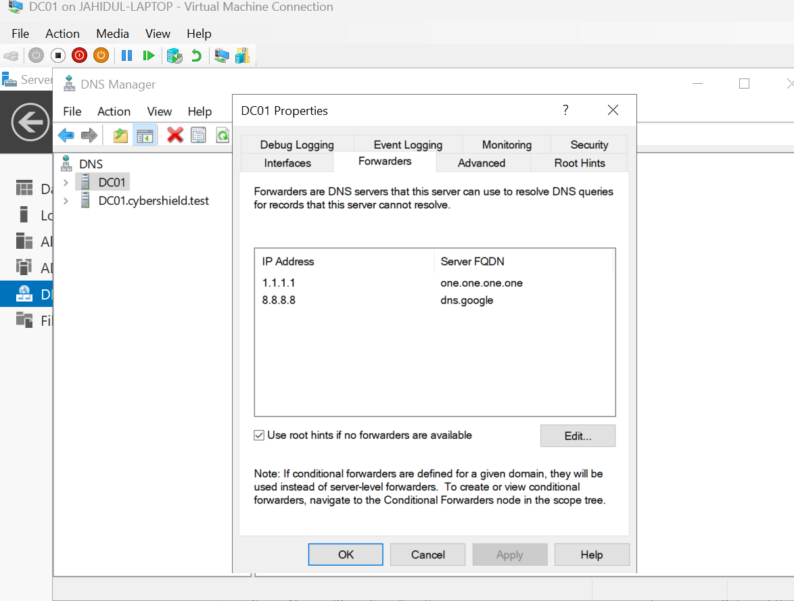

# 02 - Windows Server & Domain Controller Setup

## Overview

This section documents the deployment and configuration of **Windows Server 2022** as the first domain controller in the CyberShield Active Directory lab.

The server was configured as **DC01** and promoted to a domain controller for the new Active Directory forest **cybershield.test**. Active Directory Domain Services (AD DS) and DNS provide the core identity, authentication, name resolution, and directory services for the lab environment.

---

## Server Configuration

DC01 was deployed using **Windows Server 2022 Standard Evaluation** on the Hyper-V virtual machine configured in the previous section.

The server was assigned a consistent hostname and IPv4 configuration before being promoted to a domain controller.

| Setting | Configuration |
|---|---|
| Server Name | DC01 |
| Operating System | Windows Server 2022 Standard Evaluation |
| IPv4 Address | 10.50.0.10 |
| Active Directory Domain | cybershield.test |
| Server Role | Domain Controller |
| Directory Service | Active Directory Domain Services (AD DS) |
| DNS Role | DNS Server |

A static IPv4 address is important for a domain controller because domain clients and other infrastructure services must be able to reliably locate DNS and Active Directory services.



---

## Active Directory Domain Services

The **Active Directory Domain Services (AD DS)** role was installed on DC01 through Server Manager.

After installing the role, DC01 was promoted to the first domain controller in a new Active Directory forest using:

`cybershield.test`

As the first domain controller in the forest, DC01 provides the core directory services for the CyberShield environment.

The AD DS Server Manager view confirms that DC01 is online and operating at `10.50.0.10`.



---

## Active Directory Domain

The domain created for the lab is:

`cybershield.test`

The environment currently consists of a single forest and single domain, which provides a suitable foundation for practising enterprise Active Directory administration while keeping the home-lab architecture manageable.

The domain configuration was validated using PowerShell:

```powershell
Get-ADDomain
```

The output confirms several important properties of the environment, including:

- Domain DNS root: `cybershield.test`
- NetBIOS name: `CYBERSHIELD`
- Domain mode: `Windows2016Domain`
- PDC Emulator: `DC01.cybershield.test`
- RID Master: `DC01.cybershield.test`
- Infrastructure Master: `DC01.cybershield.test`

Because DC01 is currently the first and only domain controller in the lab, it holds the domain FSMO roles.



---

## DNS Integration

DNS is a critical dependency for Active Directory. Domain-joined systems use DNS to locate domain controllers and Active Directory services.

The DNS Server role was installed alongside Active Directory Domain Services on DC01.

The Active Directory DNS namespace is:

`cybershield.test`

DC01 therefore provides internal DNS resolution for the CyberShield domain.

### DNS Forwarders

External DNS queries that cannot be resolved by the internal DNS server are forwarded to external resolvers.

The following DNS forwarders were configured:

| DNS Provider | Address |
|---|---|
| Cloudflare | 1.1.1.1 |
| Google Public DNS | 8.8.8.8 |

This allows DC01 to remain the primary DNS server for the Active Directory environment while forwarding external queries when required.



---

## Design Considerations

The lab uses a dedicated domain controller rather than installing Active Directory services directly on the Windows 11 host. This keeps the domain infrastructure isolated inside the Hyper-V environment and allows additional servers and client systems to be added later.

Using DC01 for both **AD DS and DNS** is appropriate for the current single-domain-controller lab and demonstrates the relationship between Active Directory and DNS.

The internal `cybershield.test` namespace also keeps the lab logically separated from public production DNS infrastructure.

---

## Validation

The following checks were used to confirm that the domain controller was operating correctly:

- DC01 was online and manageable through Server Manager.
- The server was joined to the `cybershield.test` domain as its domain controller.
- AD DS was running on DC01.
- The Active Directory domain could be queried successfully with PowerShell.
- DNS services were installed and configured.
- External DNS forwarders were configured.
- DC01 was operating using the static IPv4 address `10.50.0.10`.

Additional DNS resolution testing and Active Directory object configuration are documented in later sections.

---

## Skills Demonstrated

This stage of the project demonstrates practical experience with:

- Windows Server 2022 administration
- Active Directory Domain Services installation
- Domain controller deployment
- Active Directory forest and domain creation
- Static IPv4 server configuration
- DNS integration with Active Directory
- DNS forwarder configuration
- PowerShell-based Active Directory validation
- Server Manager administration
- Basic Windows infrastructure design

---

## Next Step

With the domain infrastructure operational, the next stage is to design the Active Directory organisational structure using **Organisational Units (OUs)** and create departmental user accounts for Finance, HR, IT, and Sales.
