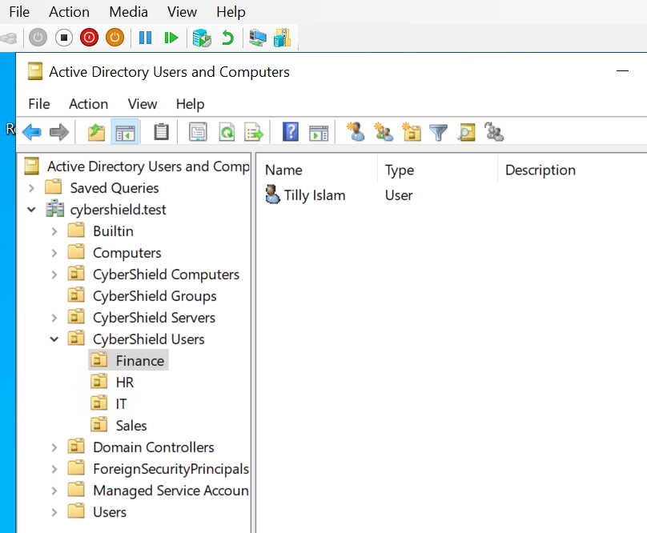
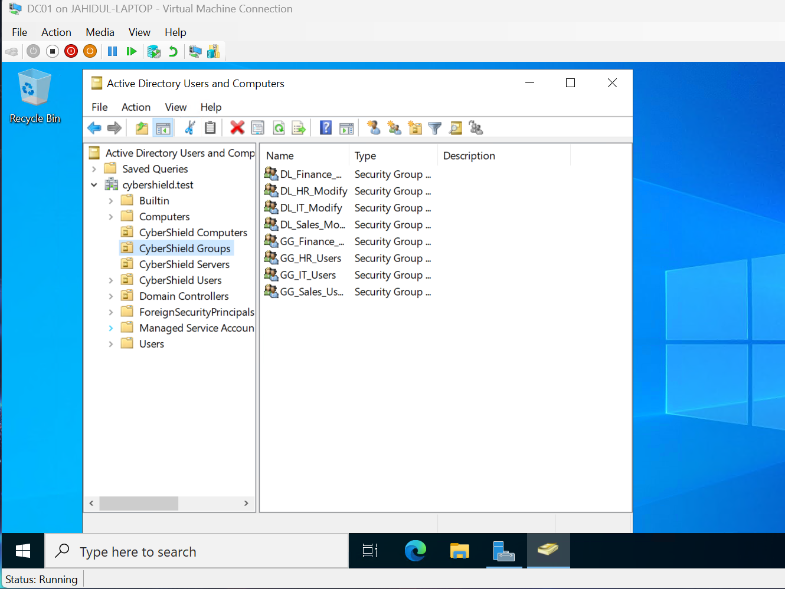
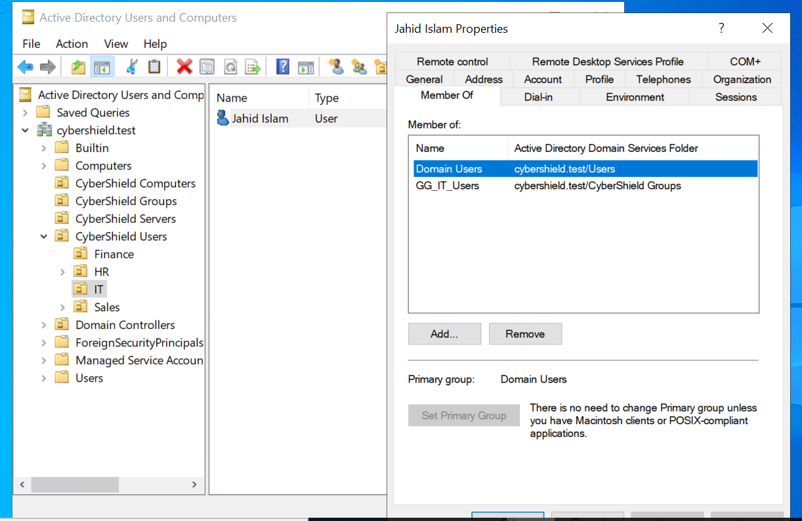
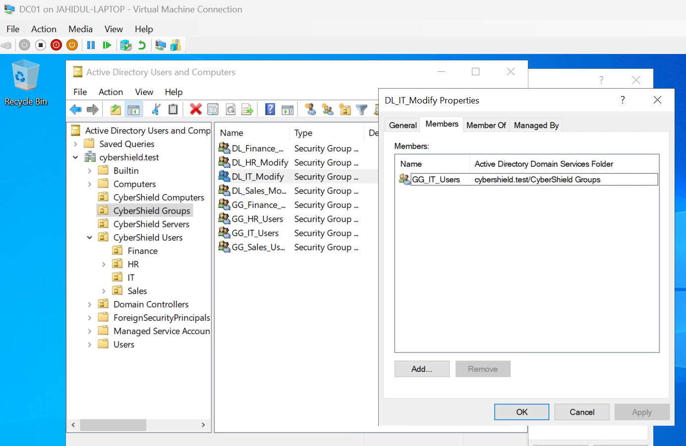
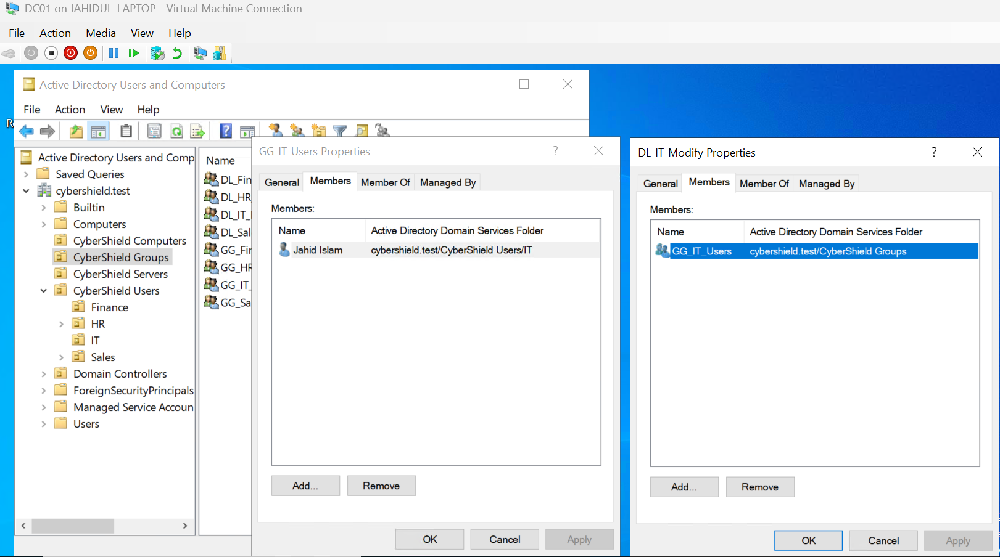

# 03 - Active Directory Structure & Group Management

This section documents the design and implementation of the Active Directory organisational structure for the CyberShield lab, including organisational units (OUs), departmental user accounts, security groups, and role-based access using the AGDLP model.

## Organisational Unit Design

To organise Active Directory in a structured and scalable way, custom Organisational Units (OUs) were created under the `cybershield.test` domain.

The following OU structure was implemented:

- **CyberShield Users**
  - Finance
  - HR
  - IT
  - Sales
- **CyberShield Groups**
- **CyberShield Computers**
- **CyberShield Servers**

Departmental user accounts were placed inside their respective OUs. This structure separates users, groups, client computers, and servers, making administration and future Group Policy deployment easier to manage.

## Security Group Design

Security groups were created to implement role-based access control using the AGDLP model. Separate Global Groups represent departmental users, while Domain Local Groups are designed to receive permissions to resources.

### Global Groups

The following Global Security Groups were created:

- `GG_Finance_Users`
- `GG_HR_Users`
- `GG_IT_Users`
- `GG_Sales_Users`

These groups represent users according to their department. User accounts are added to the appropriate Global Group rather than being assigned permissions directly.

### Domain Local Groups

The following Domain Local Security Groups were created:

- `DL_Finance_Modify`
- `DL_HR_Modify`
- `DL_IT_Modify`
- `DL_Sales_Modify`

These groups are intended to receive permissions to departmental resources such as shared folders. This separates user membership from resource permissions and provides a more scalable access-control structure.

## User and Global Group Membership

Departmental user accounts were assigned to the appropriate Global Security Groups. This follows the first stages of the AGDLP model, where user accounts are placed into Global Groups based on their organisational role.

For example, the IT user account `Jahid Islam` was added to the `GG_IT_Users` Global Security Group.

This allows access to be managed through group membership rather than assigning permissions directly to individual user accounts.

**Membership path:**

`Jahid Islam` → `GG_IT_Users`

## Global Group and Domain Local Group Membership

The departmental Global Security Groups were nested inside corresponding Domain Local Security Groups. This implements the next stage of the AGDLP model and separates user-role membership from resource permissions.

For the IT department, `GG_IT_Users` was added as a member of `DL_IT_Modify`.

**Membership path:**

`GG_IT_Users` → `DL_IT_Modify`

This means permissions can later be assigned to `DL_IT_Modify` rather than directly to individual users or the Global Group. If access requirements change, administrators can manage group membership without modifying permissions on the resource itself.

## AGDLP Group Nesting

The completed group structure demonstrates the AGDLP approach used in the CyberShield lab.

For the IT department, the access path is:

**Account → Global Group → Domain Local Group → Permission**

`Jahid Islam` → `GG_IT_Users` → `DL_IT_Modify` → `Modify Permission`

The user account is first assigned to the departmental Global Group. The Global Group is then nested inside the Domain Local Group. Resource permissions can therefore be assigned to the Domain Local Group rather than directly to the user.

This provides a scalable access-control model. Users can be added or removed from departmental Global Groups as their roles change, while resource permissions remain associated with the Domain Local Group.

## Validation and Learning Outcome

The Active Directory structure was validated using Active Directory Users and Computers. User accounts were confirmed to be located within their appropriate departmental OUs, and security group memberships were checked to verify the intended AGDLP relationships.

The implemented structure demonstrates several core Active Directory administration concepts:

- Organising users and resources using Organizational Units (OUs)
- Creating Global and Domain Local Security Groups
- Assigning users to role-based Global Groups
- Nesting Global Groups inside Domain Local Groups
- Using group-based access control instead of assigning permissions directly to individual users
- Designing Active Directory with scalability and future Group Policy deployment in mind

The current configuration establishes the Account, Global Group, and Domain Local Group stages of AGDLP. The final Permission stage will be implemented when departmental shared folders and NTFS permissions are configured later in the lab.
