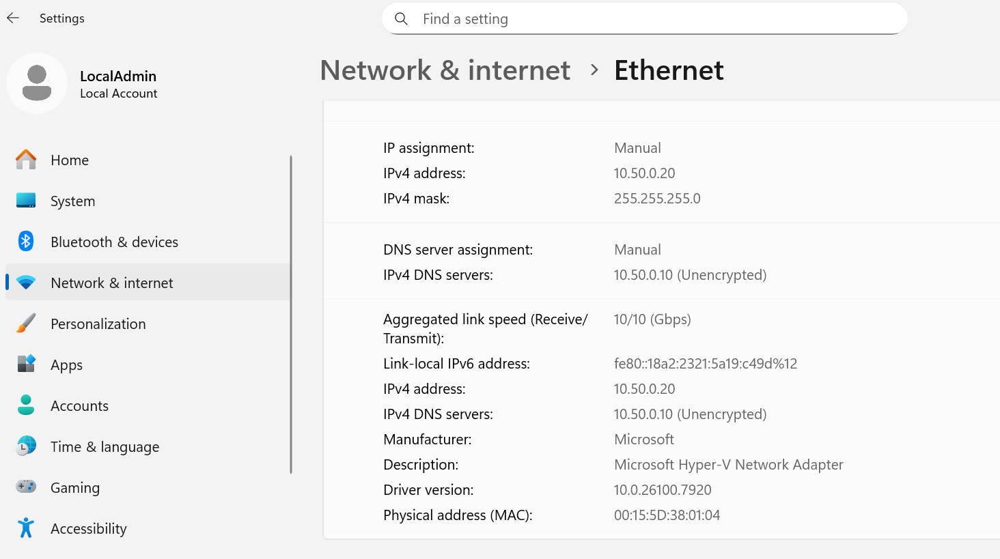
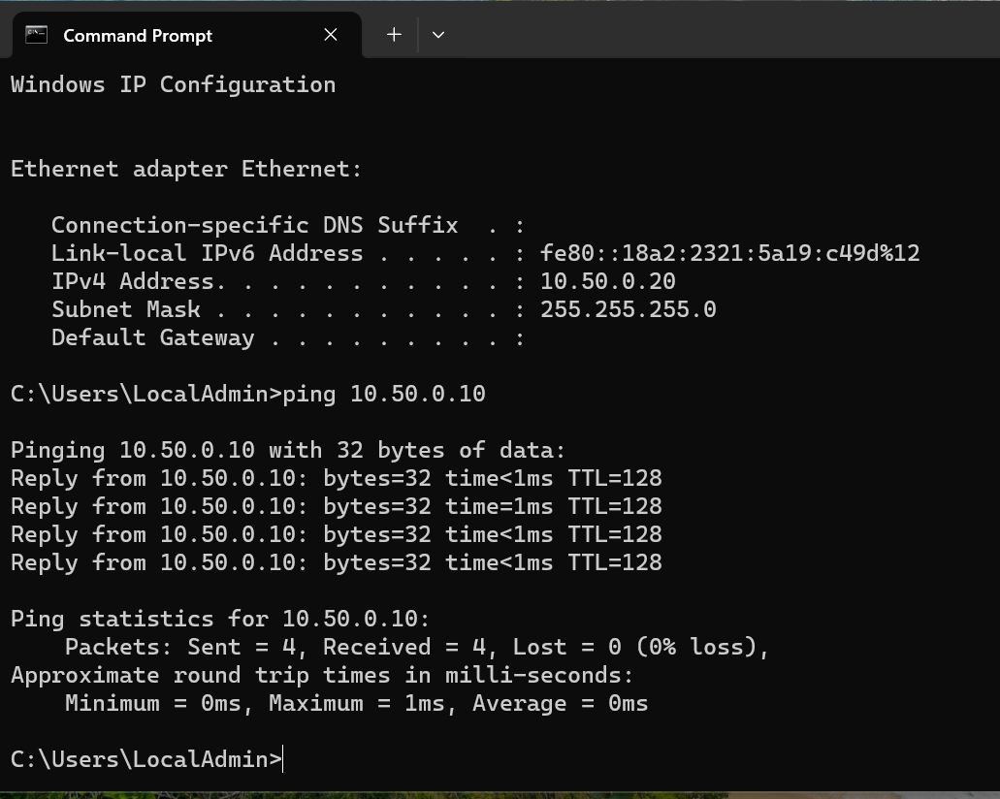
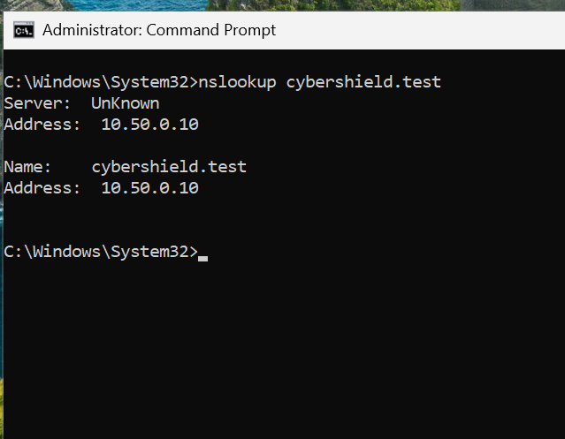
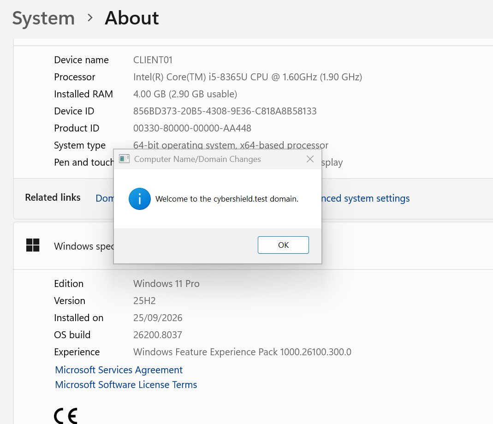
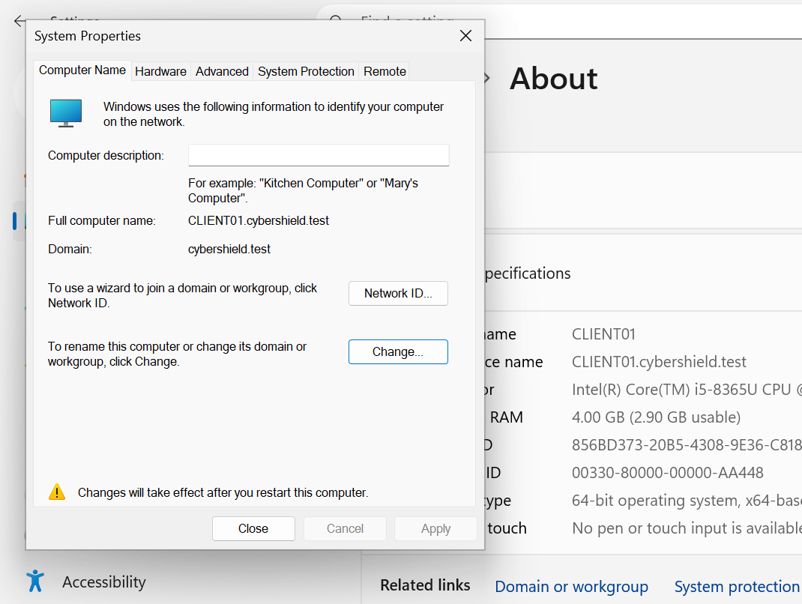
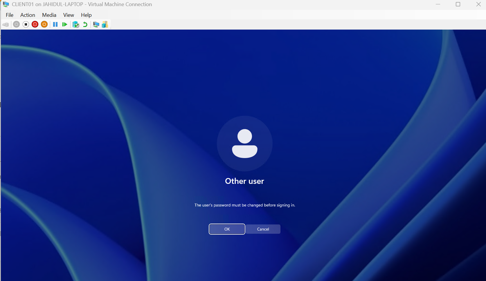
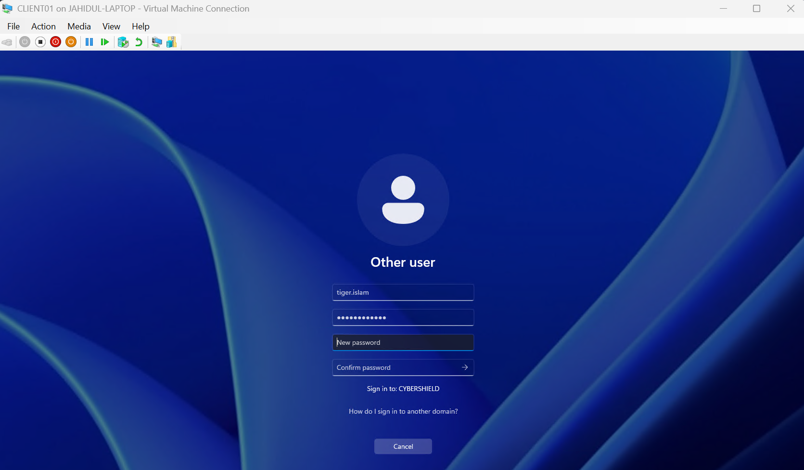
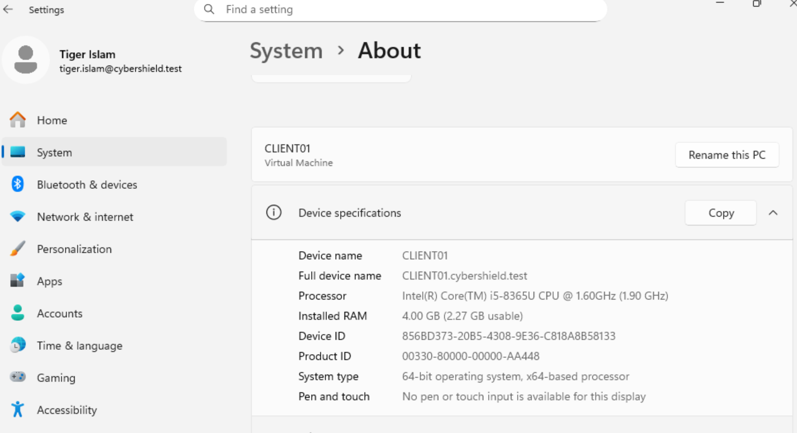

# 04 - Windows 11 Client & Domain Join

This section documents the deployment and configuration of a Windows 11 Pro client workstation in the CyberShield Active Directory lab.

The virtual machine, named `CLIENT01`, was configured with a static IPv4 address and uses the domain controller `DC01` as its DNS server. Network connectivity and Active Directory DNS resolution were validated before joining the client to the `cybershield.test` domain.

After the domain join, domain authentication was tested using an Active Directory user account, including the password-change-at-first-logon process.

## CLIENT01 System Information

`CLIENT01` was deployed as a Windows 11 Pro Generation 2 virtual machine running on Microsoft Hyper-V.

Key configuration:

- **Computer name:** `CLIENT01`
- **Operating system:** Windows 11 Pro
- **VM generation:** Generation 2
- **Virtual CPUs:** 2
- **Configured RAM:** 4 GB
- **Virtual disk:** 80 GB VHDX
- **Virtual switch:** `CyberShield-Lab`
- **Network type:** Internal Network

## Static IPv4 and DNS Configuration

A static IPv4 configuration was assigned to `CLIENT01` so that the workstation has a predictable address within the CyberShield lab network.

The client was configured with:

- **IPv4 address:** `10.50.0.20`
- **Subnet mask:** `255.255.255.0`
- **CIDR prefix:** `/24`
- **Default gateway:** None
- **Preferred DNS server:** `10.50.0.10` (`DC01`)
- **IP assignment:** Manual
- **DNS assignment:** Manual

The DNS server is deliberately configured as `DC01` rather than a public DNS server because Active Directory clients rely on the domain controller's DNS service to locate domain resources and Active Directory services.

## Domain Controller Connectivity Test

Before joining `CLIENT01` to the Active Directory domain, network connectivity to the domain controller was verified.

The client was assigned the static IPv4 address `10.50.0.20`, while the domain controller `DC01` uses `10.50.0.10`.

The following command was used from `CLIENT01`:

`ping 10.50.0.10`

The test returned four successful replies with **0% packet loss**, confirming that `CLIENT01` could communicate with `DC01` across the CyberShield internal network.

**Connectivity path:**

`CLIENT01 (10.50.0.20)` → `DC01 (10.50.0.10)` ✅

## Active Directory DNS Resolution Test

After confirming network connectivity to `DC01`, DNS resolution was tested from the client before attempting the domain join.

The following command was used:

`nslookup cybershield.test`

The query was sent to the configured DNS server at `10.50.0.10` (`DC01`) and successfully resolved the Active Directory domain:

- **Domain:** `cybershield.test`
- **DNS server:** `10.50.0.10`
- **Resolved address:** `10.50.0.10`

This confirmed that `CLIENT01` could successfully use the domain controller's DNS service to resolve the Active Directory domain.

**DNS resolution path:**

`CLIENT01` → `DC01 DNS (10.50.0.10)` → `cybershield.test` ✅

## Joining CLIENT01 to the Active Directory Domain

After network connectivity and DNS resolution were successfully validated, `CLIENT01` was joined to the CyberShield Active Directory domain.

The client was changed from its default `WORKGROUP` membership to:

- **Domain:** `cybershield.test`
- **Domain Controller:** `DC01`
- **DNS server:** `10.50.0.10`

Administrative domain credentials were supplied to authorize the domain join.

Windows then displayed:

**"Welcome to the cybershield.test domain."**

This confirmed that `CLIENT01` had successfully joined the Active Directory domain.

## Domain Membership Validation

After joining the domain, the Windows System Properties were checked to verify the new computer identity and domain membership.

The configuration confirmed:

- **Computer name:** `CLIENT01`
- **Full computer name:** `CLIENT01.cybershield.test`
- **Domain:** `cybershield.test`

A restart was required to complete the domain membership changes.

This confirms that the workstation is no longer operating as a standalone `WORKGROUP` computer and is now managed as a member of the CyberShield Active Directory domain.

## Domain User Authentication Test

Domain authentication was tested using the Active Directory user account `tiger.islam`.

The account had been configured in Active Directory with:

**User must change password at next logon**

When `tiger.islam` attempted to sign in to `CLIENT01` using the temporary domain password, Windows contacted the domain controller and required the user to change the password before completing the sign-in.

This demonstrates that user authentication and password management are being centrally controlled through Active Directory rather than through a local account on `CLIENT01`.

## Domain User Password Change

Because `tiger.islam` was configured to change the temporary password at first logon, Windows presented the domain password-change screen.

The user entered the temporary password and selected a new password that would be used for future domain authentication.

The password itself is intentionally not shown or documented for security reasons.

This test demonstrates that Active Directory can centrally enforce account settings and require users to update their credentials during authentication.

## Successful Domain User Login

After completing the required password change, `tiger.islam` successfully signed in to `CLIENT01`.

Windows Settings displayed the authenticated domain identity:

- **User:** Tiger Islam
- **Domain account:** `tiger.islam@cybershield.test`
- **Computer:** `CLIENT01`
- **Active Directory domain:** `cybershield.test`

This confirms that `CLIENT01` can authenticate Active Directory users through `DC01` and that the user session is using a domain account rather than the local `LocalAdmin` account.

## Validation and Learning Outcome

The Windows 11 client deployment and Active Directory domain-join process were successfully completed and validated.

This stage of the CyberShield lab demonstrated practical experience with:

- Deploying a Windows 11 Pro client using Microsoft Hyper-V
- Configuring a static IPv4 address on an internal lab network
- Configuring the domain controller as the client's DNS server
- Testing network connectivity between a client and domain controller
- Validating Active Directory DNS resolution using `nslookup`
- Joining a Windows client to an Active Directory domain
- Verifying domain membership after restart
- Authenticating with an Active Directory domain user
- Enforcing a password change at first domain logon
- Distinguishing between local and domain user accounts

`CLIENT01` is now a fully functioning member of the `cybershield.test` Active Directory domain and can be used for future Group Policy, file-sharing, NTFS permissions, and security-policy testing.

### Section 4 Status

- [x] Windows 11 Pro client deployed
- [x] Static IPv4 configuration completed
- [x] DNS configured to use `DC01`
- [x] Connectivity to `DC01` verified
- [x] Active Directory DNS resolution verified
- [x] `CLIENT01` joined to `cybershield.test`
- [x] Domain membership confirmed
- [x] Domain user authentication tested
- [x] Password change at first logon tested
- [x] Successful domain user login confirmed
