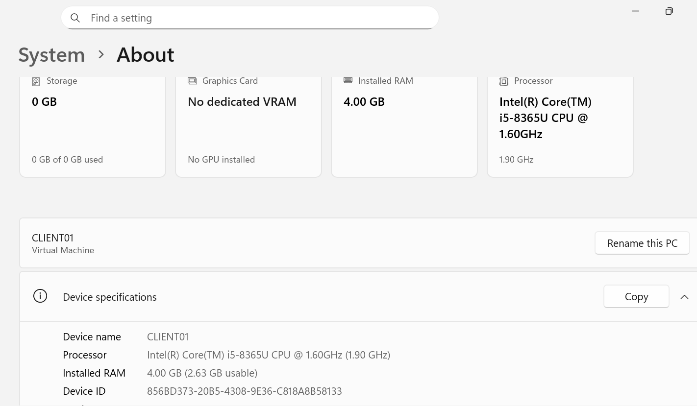

# 04 - Windows 11 Client & Domain Join

This section documents the deployment and configuration of a Windows 11 Pro client workstation in the CyberShield Active Directory lab.

The virtual machine, named `CLIENT01`, was configured with a static IPv4 address and uses the domain controller `DC01` as its DNS server. Network connectivity and Active Directory DNS resolution were validated before joining the client to the `cybershield.test` domain.

After the domain join, domain authentication was tested using an Active Directory user account, including the password-change-at-first-logon process.

## CLIENT01 System Information

`CLIENT01` was deployed as a Windows 11 Pro Generation 2 virtual machine running on Microsoft Hyper-V.

Key configuration:

- **Computer name:** `CLIENT01`
- **Operating system:** Windows 11 Pro
- **VM generation:** Generation 2
- **Virtual CPUs:** 2
- **Configured RAM:** 4 GB
- **Virtual disk:** 80 GB VHDX
- **Virtual switch:** `CyberShield-Lab`
- **Network type:** Internal Network

