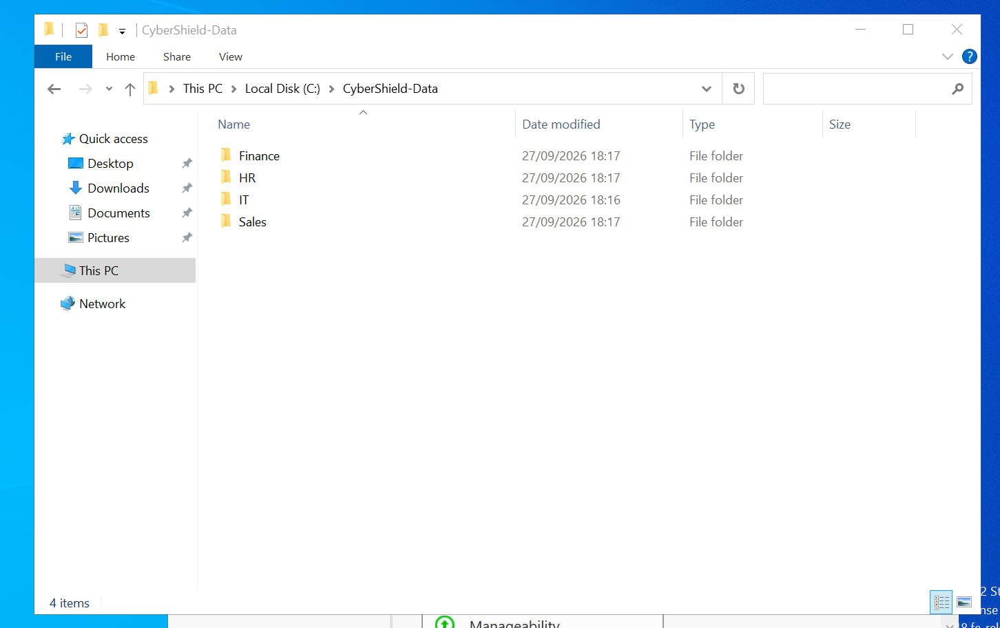
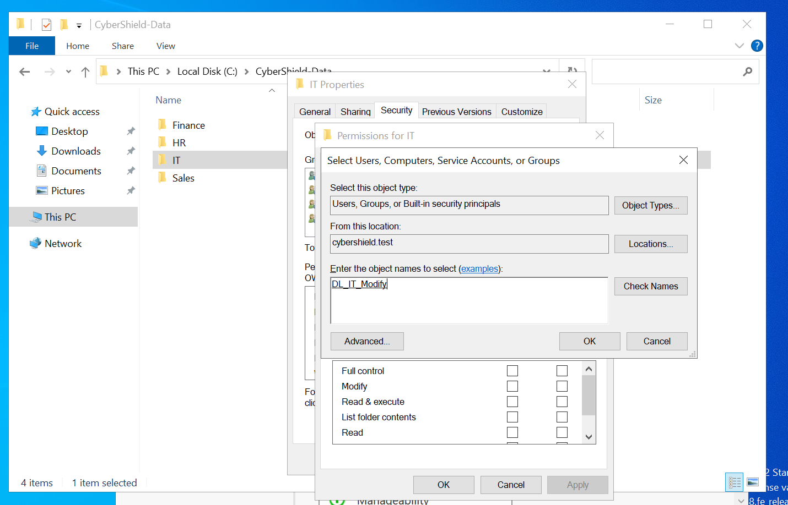
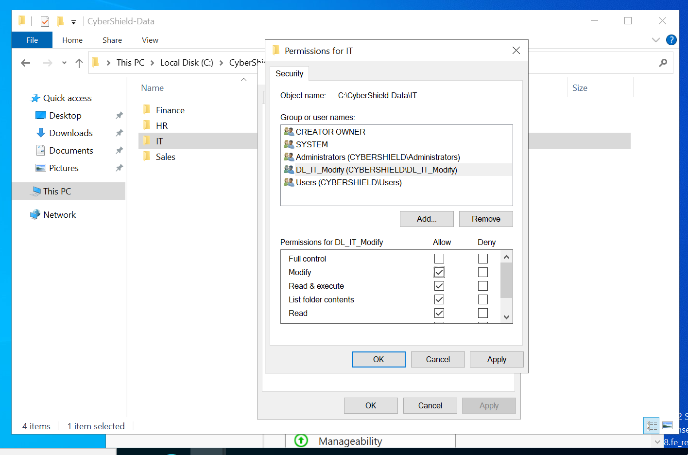
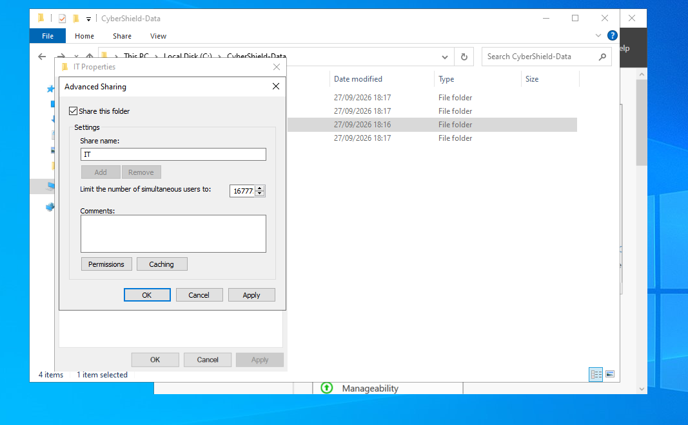
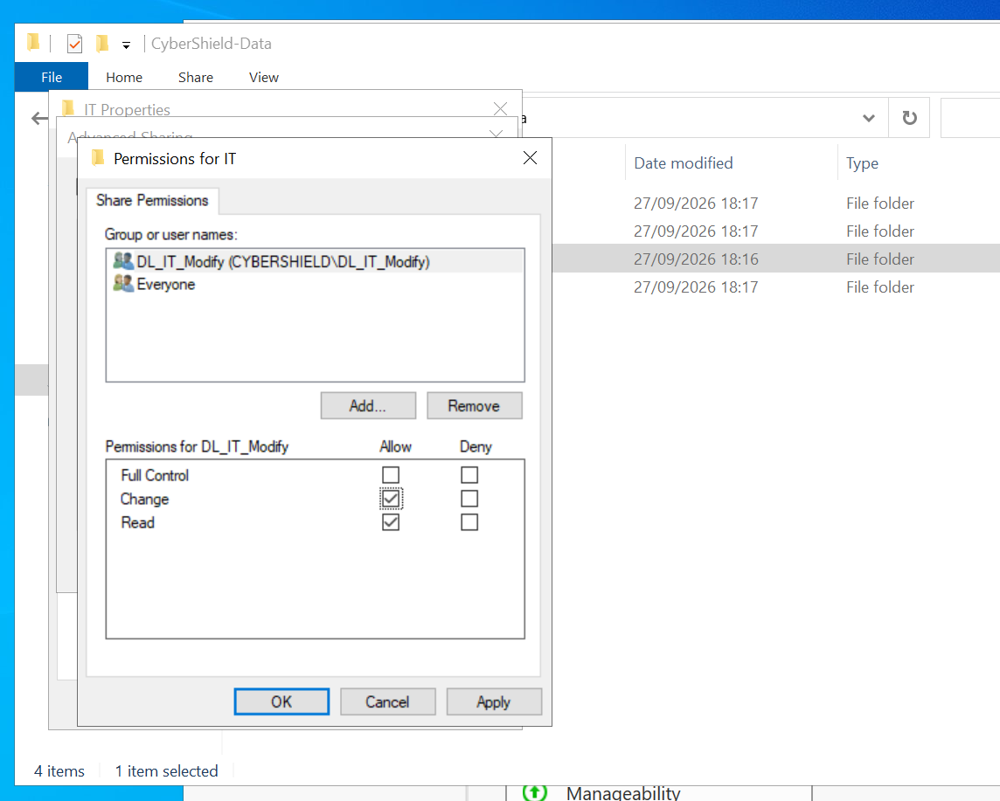
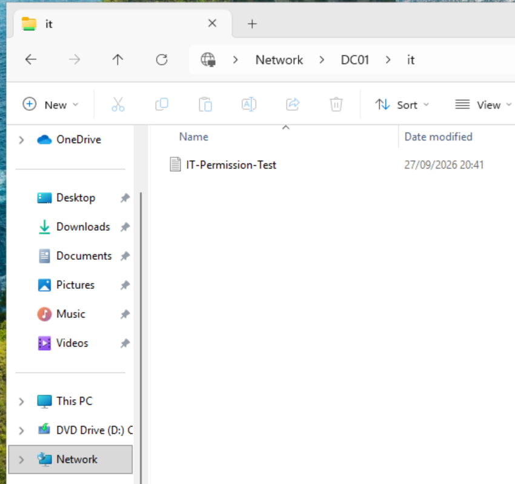
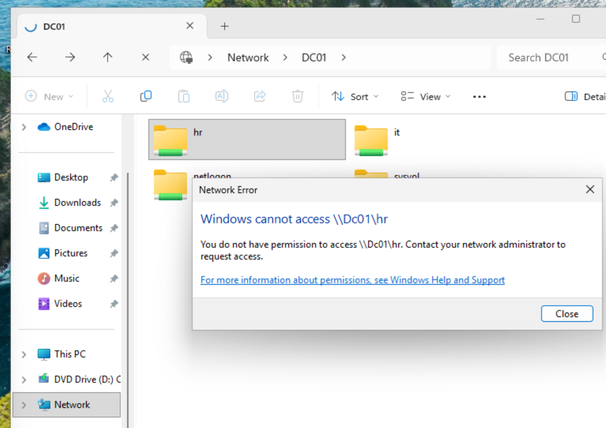
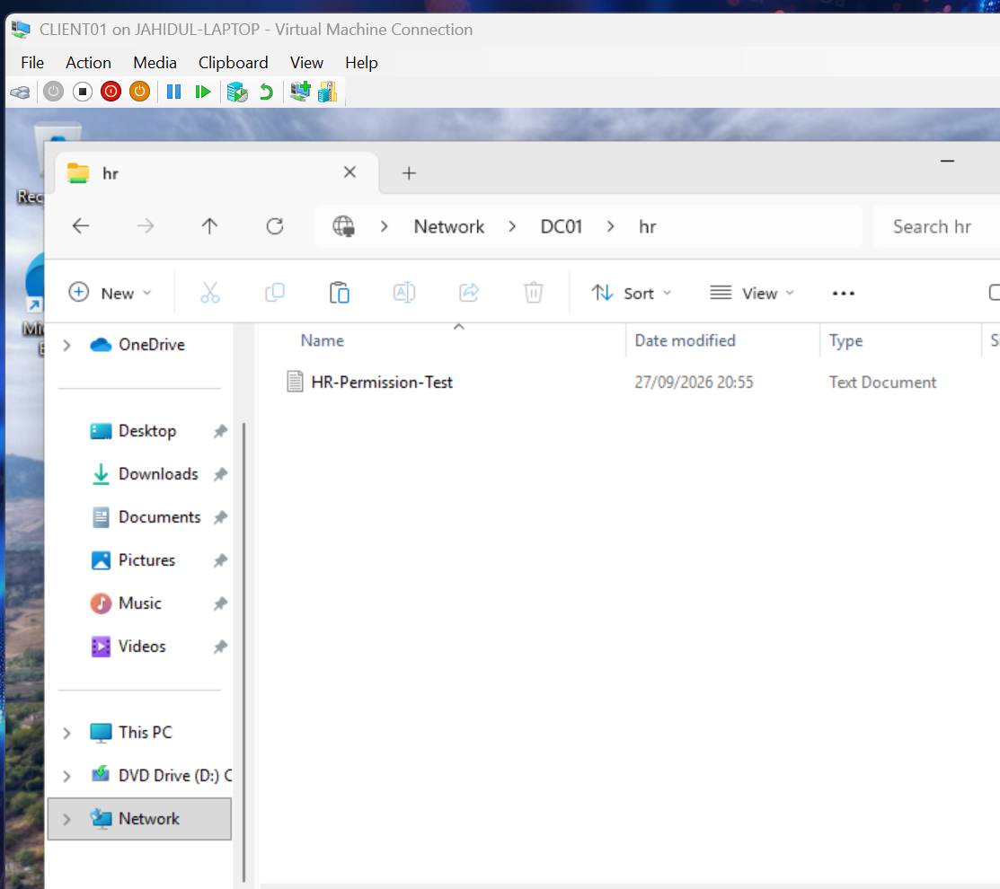
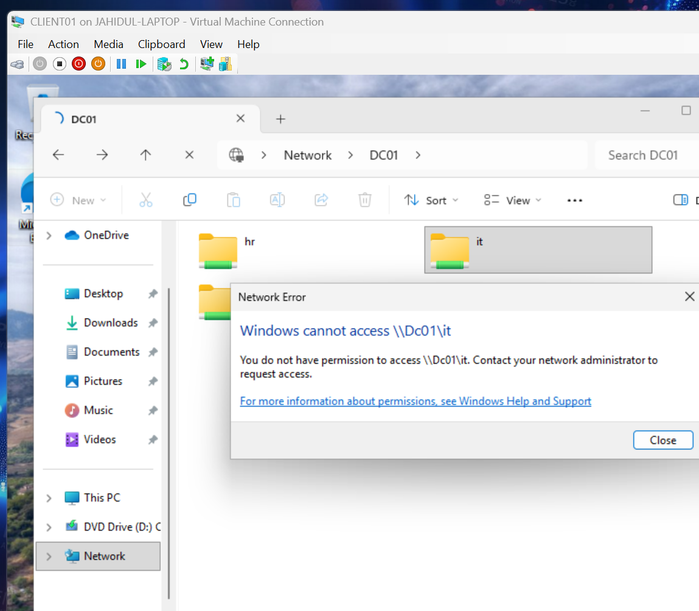

# 05 - File Sharing, NTFS Permissions & AGDLP Validation

This section documents the implementation and testing of departmental file sharing within the CyberShield Active Directory lab.

Departmental folders were created on `DC01` and secured using a combination of Active Directory security groups, NTFS permissions, and SMB share permissions.

The configuration completes the AGDLP permission model established earlier in the project:

**Accounts → Global Groups → Domain Local Groups → Permissions**

Access was then tested from the domain-joined Windows 11 workstation `CLIENT01` using users from different departments to verify both authorised access and departmental isolation.

## Departmental Folder Structure

A central data directory was created on `DC01`:

`C:\CyberShield-Data`

Four departmental folders were created:

- `Finance`
- `HR`
- `IT`
- `Sales`

This structure provides separate locations where access can be controlled according to departmental Active Directory group membership.

## Assigning the IT Department NTFS Permission

The `IT` departmental folder was secured using the Domain Local security group created earlier in the Active Directory structure.

Rather than assigning permissions directly to individual user accounts, the group `DL_IT_Modify` was selected from the `cybershield.test` domain.

This follows the AGDLP model:

`jahid.islam` → `GG_IT_Users` → `DL_IT_Modify` → Folder Permission

Windows successfully resolved `DL_IT_Modify` as an Active Directory security group before the permission was assigned.

## NTFS Modify Permission

The `DL_IT_Modify` Domain Local group was assigned **Modify** permission on the `IT` folder through the NTFS Security settings.

The permission provides members of the group with the ability to:

- Read and execute files
- List folder contents
- Read files
- Write and create files
- Modify existing files
- Delete files and folders

**Full Control** was intentionally not granted.

This completes the permission stage of the AGDLP model for the IT department:

`jahid.islam` → `GG_IT_Users` → `DL_IT_Modify` → **Modify Permission**

Permissions are therefore assigned to the Domain Local group rather than directly to individual user accounts, making access easier to manage and scale.

## SMB Share Configuration

After configuring the NTFS permissions, the `IT` folder was published as an SMB network share so that authorised domain users could access it from domain-joined workstations.

Advanced Sharing was enabled on the folder with the share name:

`IT`

This makes the departmental folder available across the lab network using the UNC path:

`\\DC01\IT`

NTFS permissions and SMB share permissions are separate access-control layers. A user accessing the folder over the network must have sufficient permissions at both layers.

## SMB Share Permissions

The `DL_IT_Modify` Domain Local group was also assigned permissions at the SMB share level.

The following share permissions were granted:

- **Change:** Allow
- **Read:** Allow
- **Full Control:** Not granted

The default `Everyone` entry was removed so that access to the departmental share is controlled through the designated Active Directory security group.

When a user accesses a shared folder across the network, both **Share permissions** and **NTFS permissions** are evaluated. The user's effective access cannot exceed the more restrictive of the two permission sets.

For the IT department:

- **NTFS permission:** Modify
- **Share permission:** Change + Read
- **Result:** IT users can create, read, modify, and delete files within the permissions granted by the NTFS ACL.

This provides controlled access without granting unnecessary Full Control privileges.

## Authorised IT User Access Test

The permissions were tested from the domain-joined Windows 11 workstation `CLIENT01`.

The test was performed while signed in with the IT domain user:

`CYBERSHIELD\jahid.islam`

Because `jahid.islam` is a member of `GG_IT_Users`, which is nested inside `DL_IT_Modify`, the user inherits the permissions assigned to the IT departmental folder.

The network share was accessed using:

`\\DC01\IT`

A test file named `IT-Permission-Test` was successfully created inside the share.

This confirms that the complete AGDLP permission chain is functioning:

`jahid.islam` → `GG_IT_Users` → `DL_IT_Modify` → `\\DC01\IT` → **Modify Access** ✅

## Departmental Access Isolation Test

To verify that departmental permissions were correctly isolated, the same IT user `jahid.islam` attempted to access the HR network share:

`\\DC01\HR`

The user was denied access because `jahid.islam` is not a member of the HR permission chain:

`GG_HR_Users` → `DL_HR_Modify`

Windows returned an **Access Denied** message confirming that the user did not have permission to access the HR share.

This demonstrates that simply being an authenticated domain user does not automatically provide access to other departmental resources. Access is controlled through Active Directory group membership and the configured SMB and NTFS permissions.

**Test result:**

`jahid.islam (IT)` → `\\DC01\HR` → **Access Denied** 🔒

## Authorised HR User Access Test

A second domain user was used to verify that the HR share was correctly accessible to authorised HR personnel.

The test was performed from `CLIENT01` while signed in as:

`CYBERSHIELD\tiger.islam`

`tiger.islam` is an HR user whose group membership provides access through the HR AGDLP permission chain.

The HR network share was accessed using:

`\\DC01\HR`

A test file named `HR-Permission-Test` was successfully created inside the share.

This confirms that the HR departmental permissions are functioning correctly and that authorised HR users can create and modify files within their designated network share.

**Test result:**

`tiger.islam (HR)` → `\\DC01\HR` → **File Creation Successful** ✅

## Reverse Departmental Isolation Test

To confirm that departmental isolation worked in both directions, the HR user `tiger.islam` attempted to access the IT network share:

`\\DC01\IT`

The user was denied access because the HR account is not part of the IT permission chain:

`GG_IT_Users` → `DL_IT_Modify`

Windows returned an **Access Denied** message confirming that the HR user did not have permission to access the IT departmental share.

Together with the previous tests, this demonstrates two-way departmental access control:

- `jahid.islam (IT)` → `IT` → **Allowed** ✅
- `jahid.islam (IT)` → `HR` → **Denied** 🔒
- `tiger.islam (HR)` → `HR` → **Allowed** ✅
- `tiger.islam (HR)` → `IT` → **Denied** 🔒

## Validation and Learning Outcome

The departmental file-sharing configuration was successfully implemented and validated using Active Directory group-based access control.

This stage of the CyberShield lab demonstrated practical experience with:

- Creating departmental data folders on Windows Server
- Configuring NTFS permissions using Active Directory security groups
- Applying the AGDLP permission model
- Configuring SMB network shares
- Understanding the difference between NTFS and Share permissions
- Applying least-privilege access without granting unnecessary Full Control
- Removing the default `Everyone` share permission
- Accessing SMB shares using UNC paths
- Testing permissions from a domain-joined Windows workstation
- Validating authorised file creation
- Validating denied cross-department access
- Troubleshooting and verifying effective permissions

### AGDLP Implementation

The IT permission chain was successfully completed:

`jahid.islam` → `GG_IT_Users` → `DL_IT_Modify` → `IT Folder Modify Permission`

The same group-based access-control principle was applied to the HR department.

Permissions were assigned to Domain Local groups rather than directly to individual user accounts, allowing user access to be managed through Active Directory group membership.

### Access Validation Results

| Domain User | Department | IT Share | HR Share |
|---|---|---|---|
| `jahid.islam` | IT | Modify access ✅ | Access denied 🔒 |
| `tiger.islam` | HR | Access denied 🔒 | Modify access ✅ |

These results confirm that authorised users can access and modify resources belonging to their own department while access to other departmental resources remains restricted.

### Section 5 Status

- [x] Departmental folder structure created
- [x] Domain Local groups assigned NTFS permissions
- [x] NTFS Modify permission configured
- [x] SMB sharing enabled
- [x] Share permissions configured
- [x] Default `Everyone` share access removed
- [x] AGDLP permission model completed
- [x] IT authorised access validated
- [x] IT-to-HR unauthorised access denied
- [x] HR authorised access validated
- [x] HR-to-IT unauthorised access denied

The CyberShield lab now provides centrally managed, group-based departmental file access through Active Directory, NTFS permissions, and SMB sharing.
