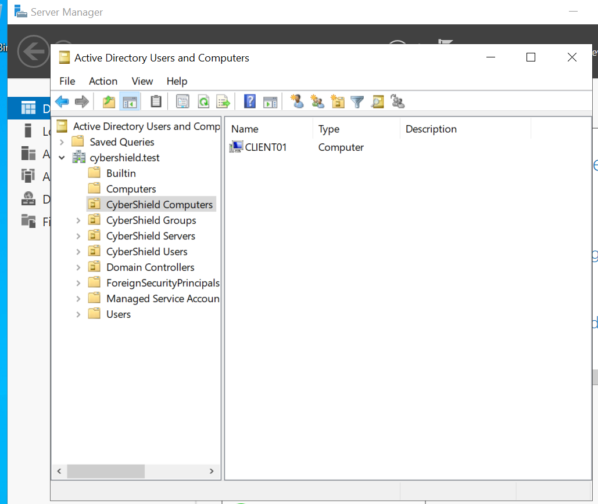
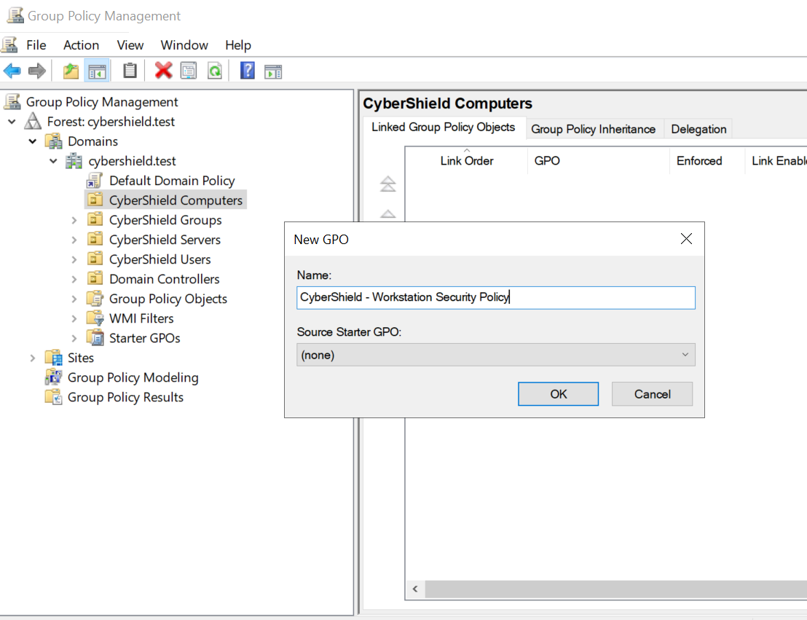
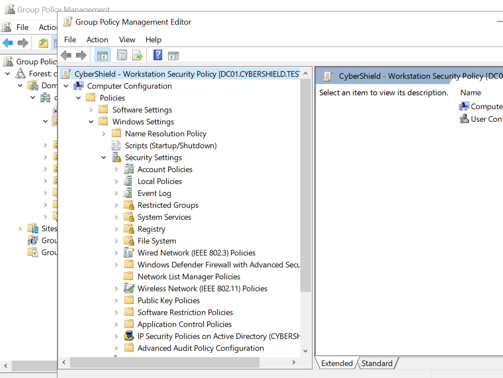
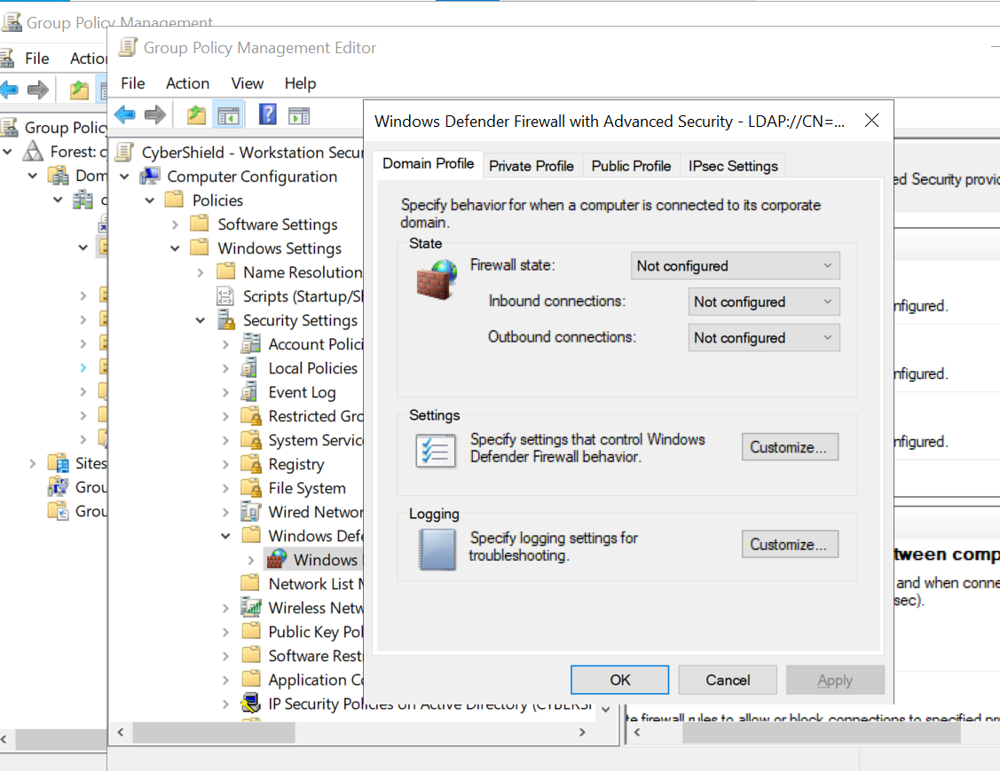
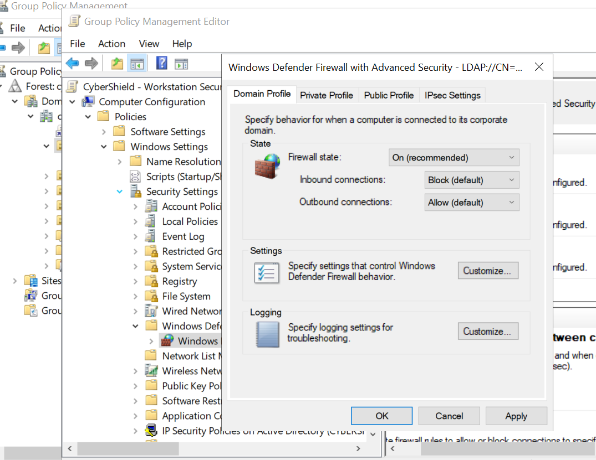
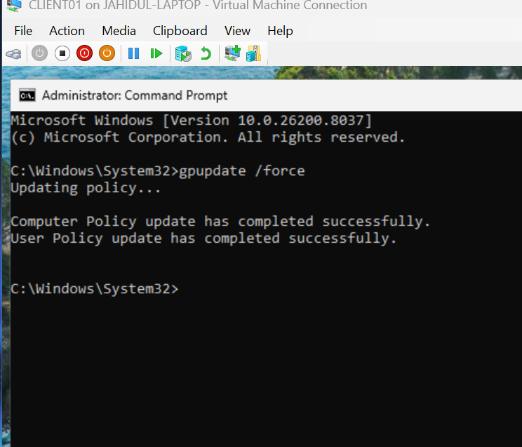
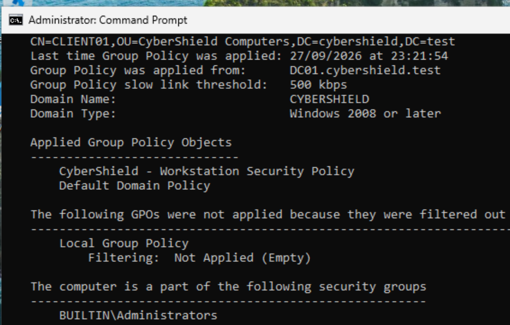
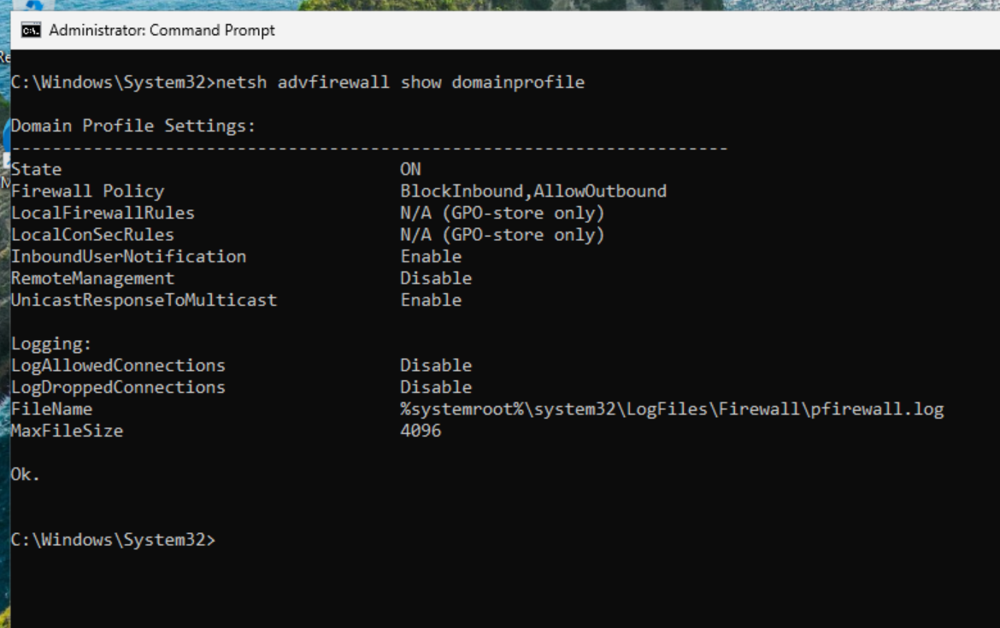

# 06 - Group Policy & Workstation Security

This section documents the implementation of centralized workstation security controls using Group Policy within the `cybershield.test` Active Directory domain.

A dedicated Group Policy Object (GPO) was created and linked to the `CyberShield Computers` Organizational Unit (OU). This allows security settings to be centrally configured on the domain controller and automatically applied to domain-joined workstations such as `CLIENT01`.

The implementation demonstrates:

- Organizing domain computers into a dedicated OU
- Creating and linking a workstation security GPO
- Centrally managing Windows Defender Firewall settings
- Forcing Group Policy updates on a domain workstation
- Verifying applied Group Policy using `gpresult`
- Validating the resulting firewall configuration on `CLIENT01`

## Group Policy Management

Group Policy Management Console (GPMC) was used on `DC01` to manage policies within the `cybershield.test` domain.

The existing Active Directory OU structure is visible in GPMC, allowing policies to be targeted at specific groups of computers or users without modifying the Default Domain Policy.

## Workstation OU Placement

For computer-based Group Policy to target `CLIENT01`, the computer account was moved from the default `Computers` container into the dedicated `CyberShield Computers` OU.

This provides a structured way to manage workstation policies separately from servers, users, and other Active Directory objects.

`CLIENT01` is now located at:

`cybershield.test → CyberShield Computers → CLIENT01`

This OU placement allows computer-based GPOs linked to `CyberShield Computers` to apply to the workstation.

## Creating the Workstation Security GPO

A dedicated Group Policy Object was created for managing security settings on domain-joined workstations.

The GPO was created and linked directly to the `CyberShield Computers` OU and named:

`CyberShield - Workstation Security Policy`

Using a dedicated GPO rather than modifying the Default Domain Policy keeps workstation security configuration organized and makes the policy easier to manage, troubleshoot, and extend.

## Configuring Computer Security Settings

The `CyberShield - Workstation Security Policy` GPO was edited through Group Policy Management Editor.

Because the security controls in this policy are intended to configure the workstation itself rather than an individual user account, the settings were configured under:

`Computer Configuration → Policies → Windows Settings → Security Settings`

This means the policy follows the computer object. Regardless of which authorized domain user signs in to `CLIENT01`, the workstation receives the computer-based security configuration assigned through its OU.

## Centrally Managed Windows Defender Firewall

Windows Defender Firewall was selected as the first workstation security control managed through the new GPO.

The **Domain Profile** was configured because `CLIENT01` is a domain-joined workstation operating within the `cybershield.test` Active Directory environment.

Before configuration, the firewall settings within this GPO were shown as **Not Configured**, meaning the GPO was not yet enforcing these settings.

The Domain Profile was then configured with the following security baseline:

- **Firewall state:** On
- **Inbound connections:** Block (default)
- **Outbound connections:** Allow (default)

This configuration enables the Windows Defender Firewall on domain-connected workstations, blocks unsolicited inbound connections unless an appropriate allow rule exists, and permits normal outbound connections.

The policy provides centralized control of the workstation firewall rather than relying solely on local configuration.

## Group Policy Update on CLIENT01

After configuring the workstation security GPO on `DC01`, Group Policy was manually refreshed on the domain-joined workstation `CLIENT01`.

The following command was executed:

`gpupdate /force`

The command completed successfully for both Computer Policy and User Policy.

This forces the workstation to request the latest Group Policy configuration rather than waiting for the normal background refresh interval.

## Verifying the Applied Group Policy

Applying a Group Policy update does not by itself prove that a specific GPO was received by the workstation.

To verify the computer-side policy configuration on `CLIENT01`, the following command was executed from an elevated Command Prompt:

`gpresult /scope computer /r`

The Resultant Set of Policy (RSoP) output confirmed that `CLIENT01` received Group Policy from:

`DC01.cybershield.test`

Under **Applied Group Policy Objects**, the workstation displayed:

- `CyberShield - Workstation Security Policy`
- `Default Domain Policy`

The output also confirmed that the computer object is located within the `CyberShield Computers` OU.

This verifies the complete Group Policy targeting path:

`DC01` → `CyberShield Computers OU` → `CyberShield - Workstation Security Policy` → `CLIENT01` ✅

## Verifying the Effective Firewall Policy

After confirming that the workstation security GPO was applied, the effective Windows Defender Firewall configuration was checked directly on `CLIENT01`.

The following command was executed:

`netsh advfirewall show domainprofile`

The output confirmed the Domain Profile settings:

- **State:** ON
- **Firewall Policy:** BlockInbound,AllowOutbound
- **LocalFirewallRules:** N/A (GPO-store only)
- **LocalConSecRules:** N/A (GPO-store only)

These results match the settings configured centrally in the `CyberShield - Workstation Security Policy` GPO.

This confirms that the firewall configuration was not only defined on the domain controller, but was successfully delivered and enforced on the domain-joined workstation.

## Validation and Learning Outcome

The Group Policy implementation was successfully validated from configuration on `DC01` through enforcement on `CLIENT01`.

The completed configuration demonstrates:

- Organizing workstation computer accounts into a dedicated OU
- Creating and linking a dedicated workstation security GPO
- Configuring Windows Defender Firewall through Group Policy
- Applying centralized computer policies to a domain workstation
- Forcing policy refresh using `gpupdate`
- Verifying applied policies using `gpresult`
- Confirming the effective firewall configuration directly on the client workstation

This exercise demonstrated how Active Directory Group Policy can be used to centrally manage and enforce security settings across domain-joined Windows workstations.

It also provided practical experience with the full Group Policy lifecycle:

`Create → Link → Configure → Apply → Verify`

Rather than simply configuring a security setting, the implementation was validated from both the domain controller and client perspectives, demonstrating that the intended policy reached the correct workstation and produced the expected security configuration.

