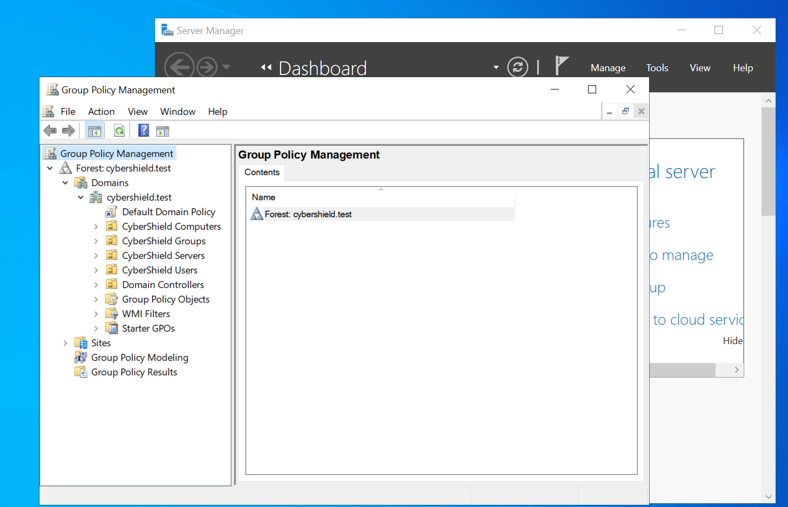

# 06 - Group Policy & Workstation Security

This section documents the implementation of centralized workstation security controls using Group Policy within the `cybershield.test` Active Directory domain.

A dedicated Group Policy Object (GPO) was created and linked to the `CyberShield Computers` Organizational Unit (OU). This allows security settings to be centrally configured on the domain controller and automatically applied to domain-joined workstations such as `CLIENT01`.

The implementation demonstrates:

- Organizing domain computers into a dedicated OU
- Creating and linking a workstation security GPO
- Centrally managing Windows Defender Firewall settings
- Forcing Group Policy updates on a domain workstation
- Verifying applied Group Policy using `gpresult`
- Validating the resulting firewall configuration on `CLIENT01`

## Group Policy Management

Group Policy Management Console (GPMC) was used on `DC01` to manage policies within the `cybershield.test` domain.

The existing Active Directory OU structure is visible in GPMC, allowing policies to be targeted at specific groups of computers or users without modifying the Default Domain Policy.

