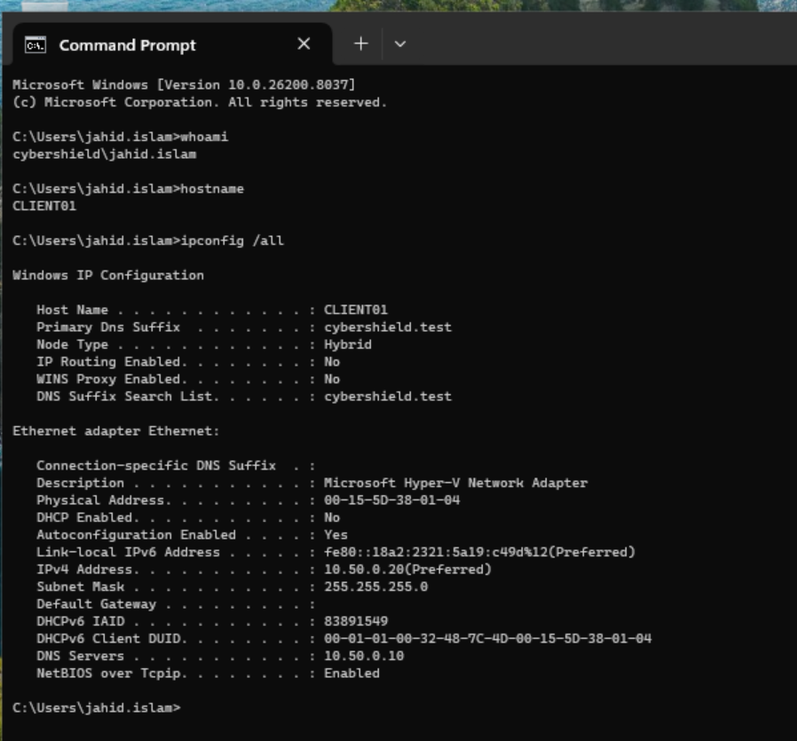

# 08 - Active Directory Administration & Troubleshooting

This section documents practical IT support and Active Directory troubleshooting scenarios within the `cybershield.test` domain.

Using `CLIENT01` and `DC01`, several common helpdesk issues were deliberately introduced, diagnosed, and resolved. The exercises focused on identifying the root cause rather than simply restoring functionality.

The scenarios demonstrate:

- Verifying user identity and workstation network configuration
- Troubleshooting domain controller and DNS connectivity
- Diagnosing an incorrect DNS server configuration
- Troubleshooting access to departmental file shares
- Identifying and correcting Active Directory group membership issues
- Managing a user transfer between departments
- Troubleshooting stale Windows security group membership after an AD change
- Using tools including `whoami`, `ipconfig`, `ping`, `nslookup`, and `gpresult`

## Troubleshooting Baseline

Before introducing faults, the identity and network configuration of `CLIENT01` were verified.

The workstation was logged in using the domain account `CYBERSHIELD\jahid.islam`, with:

- **Computer:** `CLIENT01`
- **Domain:** `cybershield.test`
- **IPv4 address:** `10.50.0.20`
- **Subnet mask:** `255.255.255.0`
- **DNS server:** `10.50.0.10` (`DC01`)

This established a known-good baseline before troubleshooting began.

