# 08 - Active Directory Administration & Troubleshooting

This section documents practical IT support and Active Directory troubleshooting scenarios within the `cybershield.test` domain.

Using `CLIENT01` and `DC01`, several common helpdesk issues were deliberately introduced, diagnosed, and resolved. The exercises focused on identifying the root cause rather than simply restoring functionality.

The scenarios demonstrate:

- Verifying user identity and workstation network configuration
- Troubleshooting domain controller and DNS connectivity
- Diagnosing an incorrect DNS server configuration
- Troubleshooting access to departmental file shares
- Identifying and correcting Active Directory group membership issues
- Managing a user transfer between departments
- Troubleshooting stale Windows security group membership after an AD change
- Using tools including `whoami`, `ipconfig`, `ping`, `nslookup`, and `gpresult`

## Troubleshooting Baseline

Before introducing faults, the identity and network configuration of `CLIENT01` were verified.

The workstation was logged in using the domain account `CYBERSHIELD\jahid.islam`, with:

- **Computer:** `CLIENT01`
- **Domain:** `cybershield.test`
- **IPv4 address:** `10.50.0.20`
- **Subnet mask:** `255.255.255.0`
- **DNS server:** `10.50.0.10` (`DC01`)

This established a known-good baseline before troubleshooting began.

## Ticket 1 - Domain Connectivity and DNS Troubleshooting

The first troubleshooting scenario simulated a workstation with an incorrect DNS server configuration.

### Verify Domain Controller Connectivity

Connectivity from `CLIENT01` to the domain controller was first tested using both the IP address and hostname.

The following commands were used:

`ping 10.50.0.10`

`ping DC01`

`nslookup DC01`

The tests confirmed that `DC01` was reachable at `10.50.0.10` and that DNS correctly resolved `DC01.cybershield.test`.

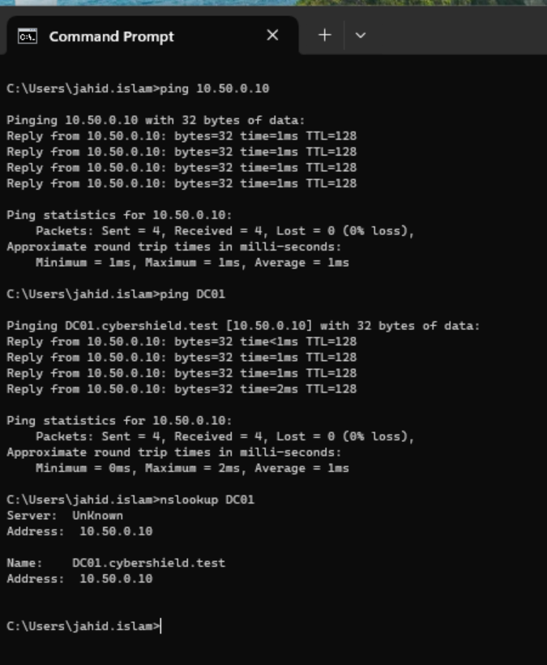

### Simulate and Diagnose a DNS Failure

To reproduce a common domain connectivity problem, the DNS server on `CLIENT01` was deliberately changed from the correct domain DNS server `10.50.0.10` to the incorrect address `10.50.0.99`.

After the change, connectivity to `10.50.0.10` still worked because basic IP connectivity was available. However, `nslookup DC01` timed out because the configured DNS server was unavailable.

This demonstrated an important troubleshooting distinction: successful network connectivity does not necessarily mean DNS is functioning correctly.

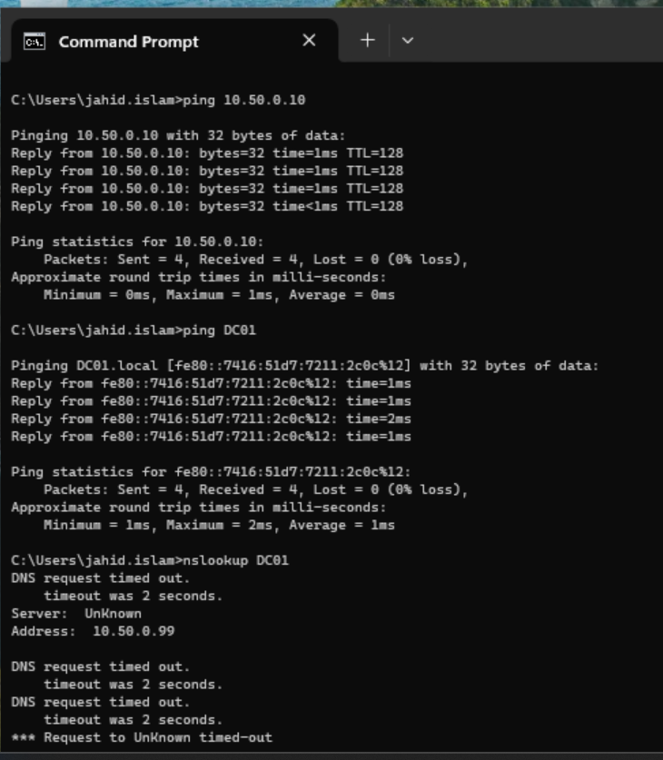

The incorrect DNS configuration was confirmed using:

`ipconfig /all`

The output showed that `CLIENT01` was configured to use `10.50.0.99` as its DNS server, identifying the root cause of the name-resolution failure.

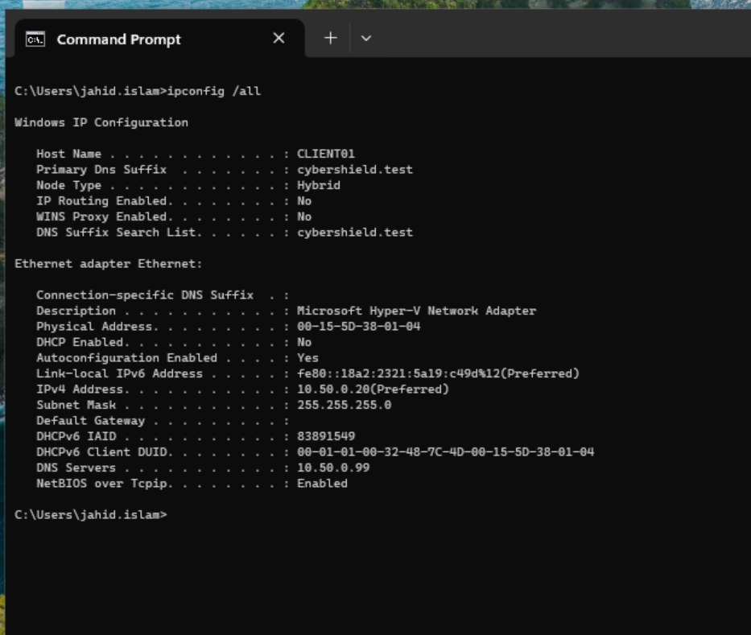

### Resolution and Verification

The DNS server configuration on `CLIENT01` was restored to the correct domain controller address:

`10.50.0.10`

After correcting the configuration, `ping DC01` successfully resolved the domain controller to `10.50.0.10`, and `nslookup DC01` again returned `DC01.cybershield.test`.

This confirmed that DNS resolution and domain connectivity had been restored successfully.

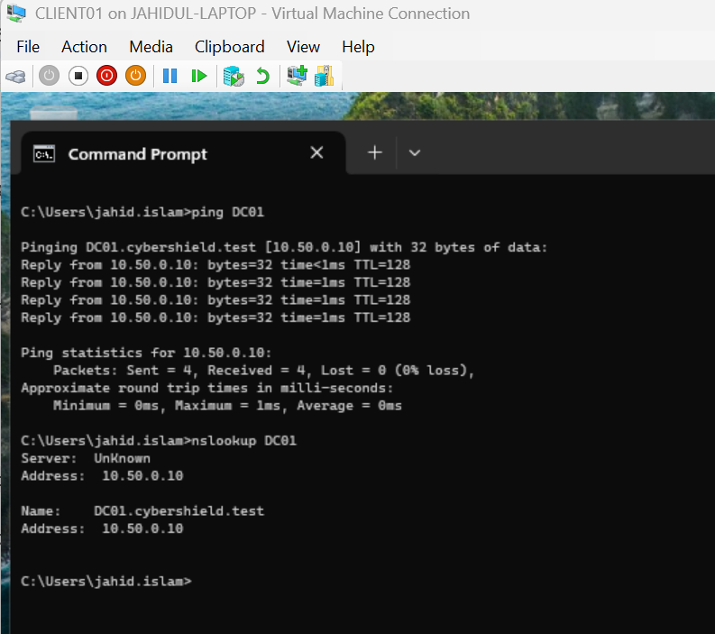
## Ticket 2 - Departmental Share Access Troubleshooting

The second troubleshooting scenario simulated an IT department user who could no longer access the departmental file share.

The `jahid.islam` account normally receives access through the AGDLP permission structure:

`jahid.islam → GG_IT_Users → DL_IT_Modify → IT Share`

To simulate a permissions-related support issue, `jahid.islam` was temporarily removed from the `GG_IT_Users` Active Directory security group.

After refreshing the user session, an attempt to access:

`\\DC01\IT`

resulted in an access-denied message.

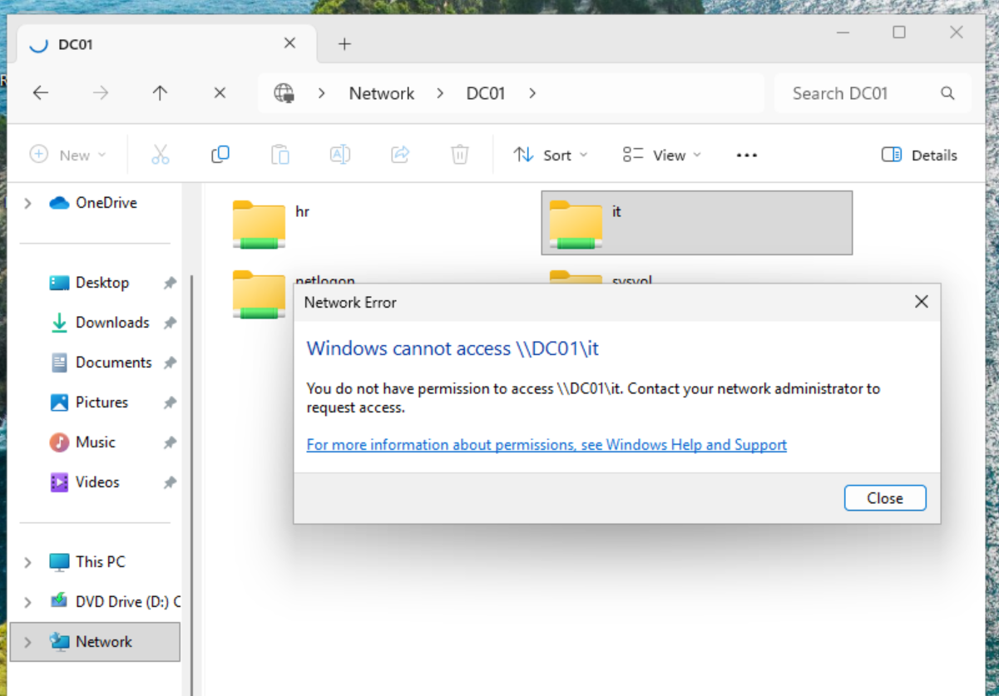

### Identifying the Root Cause

Rather than modifying the share or NTFS permissions, the user's Active Directory group membership was investigated.

The **Member Of** tab for `Jahid Islam` showed only `Domain Users`. The expected `GG_IT_Users` membership was missing.

This identified the root cause as an Active Directory group membership issue rather than a problem with the file server permissions themselves.

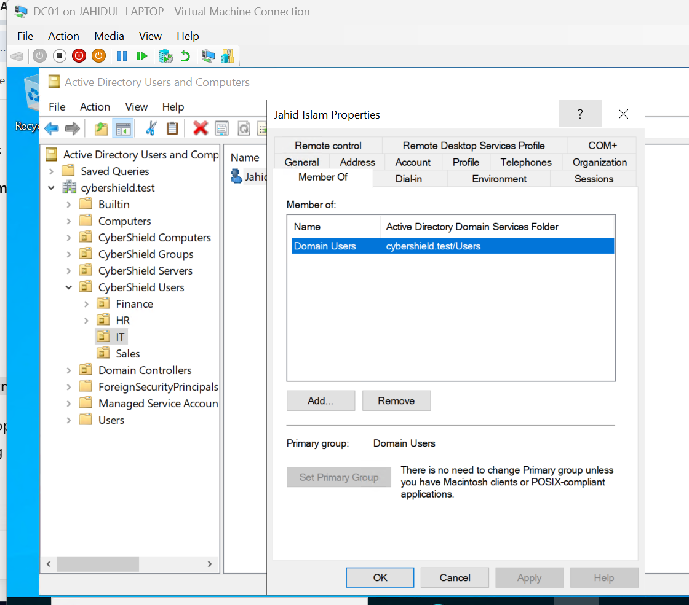

### Resolution and Verification

The `jahid.islam` account was added back to `GG_IT_Users`.

After the user's Windows session was refreshed, access to:

`\\DC01\IT`

was tested again.

The IT departmental share opened successfully, confirming that restoring the correct security group membership restored access through the existing AGDLP permission structure.

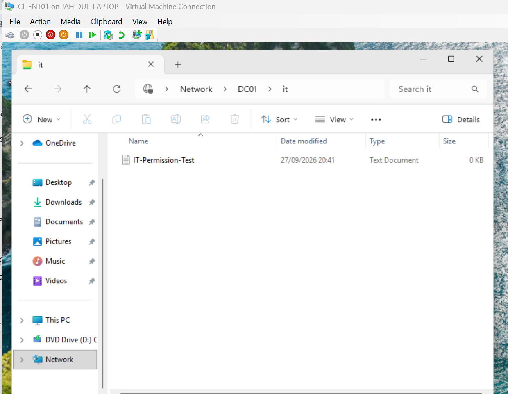
## Ticket 3 - Department Transfer and Security Token Troubleshooting

The final troubleshooting scenario simulated an employee transferring between departments.

The `bob.islam` account was initially a member of the Sales department security group:

`GG_Sales_Users`

This membership formed part of the access-control structure associated with the Sales department.

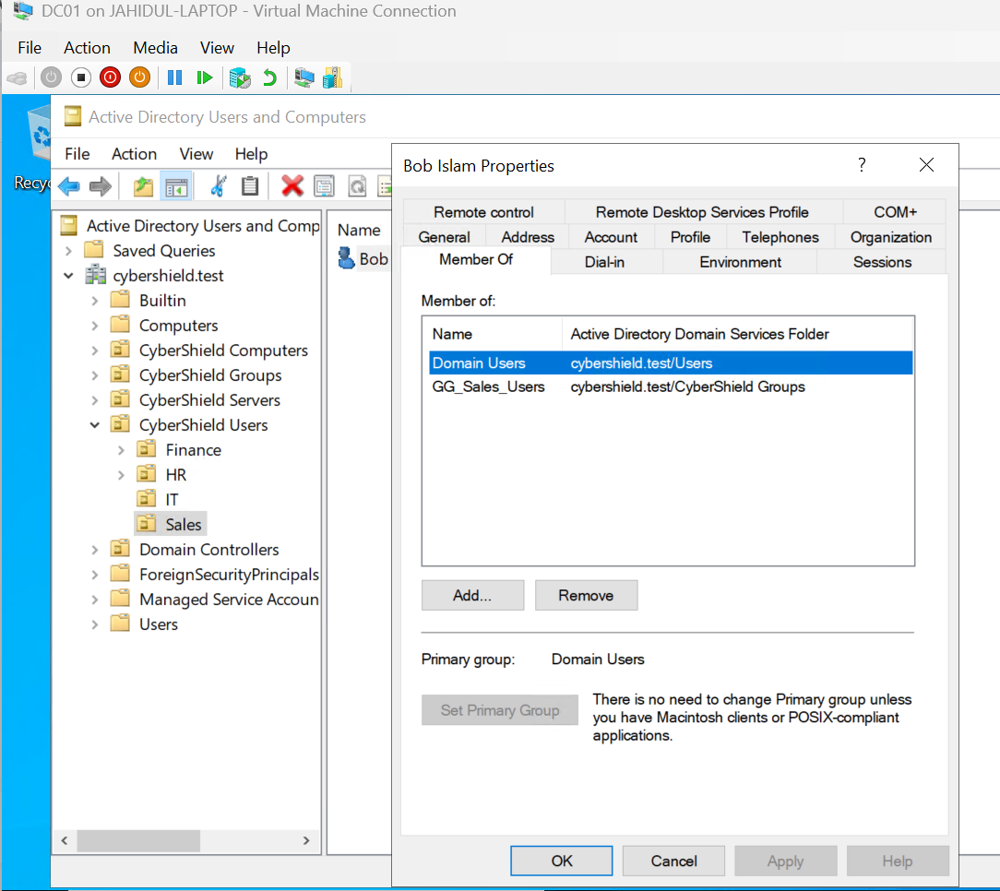

### Updating Department Group Membership

To simulate Bob transferring from Sales to HR, his Active Directory security group membership was updated.

The account was:

- Removed from `GG_Sales_Users`
- Added to `GG_HR_Users`

After the change, Bob's **Member Of** configuration showed the new HR group membership.

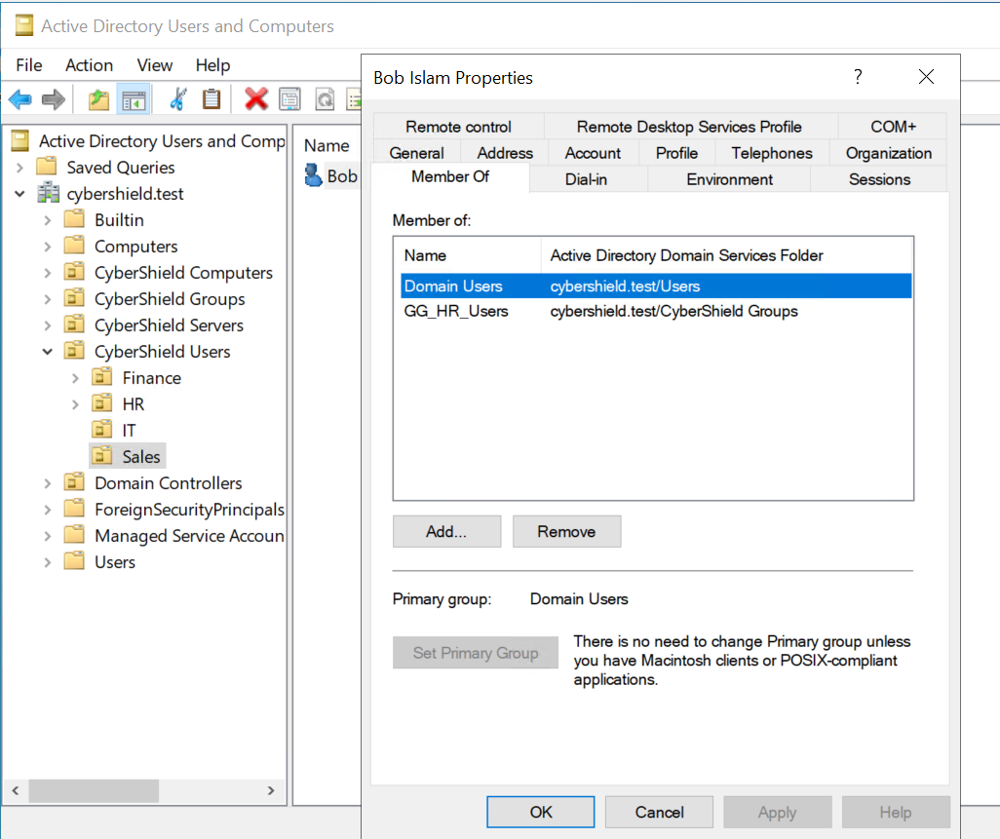

Bob was then able to access the HR departmental share at:

`\\DC01\HR`

This demonstrated that the new departmental group membership provided access through the existing HR AGDLP permission structure.

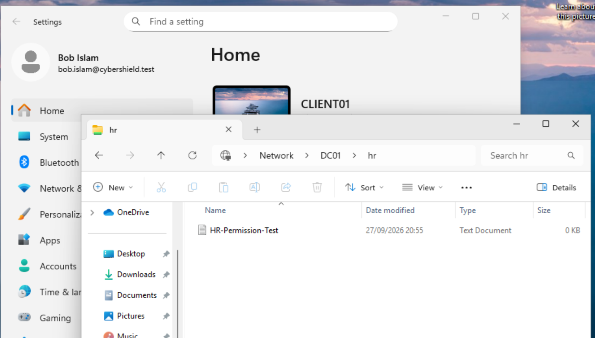

### Troubleshooting a Stale Security Token

During verification, `gpresult /r` was used to inspect Bob's current Windows session.

Although Bob's Active Directory membership had already been changed from Sales to HR, the existing Windows logon session still contained security information associated with his previous Sales membership.

This demonstrated an important Windows authentication concept: changes to Active Directory security group membership may not immediately appear in an existing user's logon token.

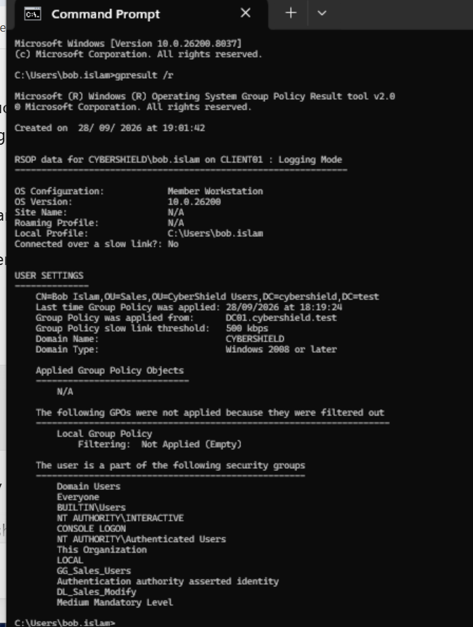

Bob was therefore completely signed out of `CLIENT01` and signed back in, creating a fresh Windows security token.

The command:

`whoami /groups`

was then used to inspect the refreshed group membership.

The new session showed:

- `CYBERSHIELD\GG_HR_Users`
- `CYBERSHIELD\DL_HR_Modify`

The previous Sales security groups were no longer present.

This confirmed that the Active Directory group membership change had been successfully incorporated into Bob's new logon security token.

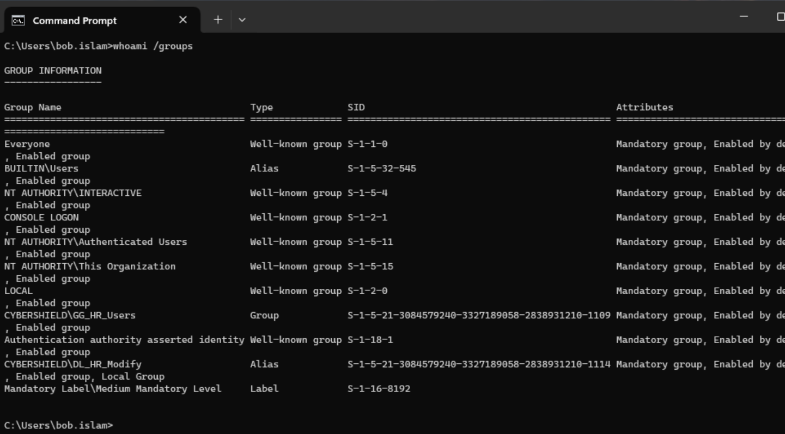

## Validation and Learning Outcome

The Active Directory administration and troubleshooting scenarios were successfully completed across `DC01` and `CLIENT01`.

Rather than immediately changing configurations when a problem occurred, each scenario followed a structured troubleshooting process:

`Identify → Investigate → Diagnose → Resolve → Verify`

The completed exercises demonstrated:

- Establishing a known-good workstation and network baseline
- Verifying user identity with `whoami`
- Reviewing workstation configuration with `ipconfig /all`
- Testing domain controller connectivity using `ping`
- Diagnosing DNS problems using `nslookup`
- Identifying an incorrectly configured DNS server
- Restoring DNS resolution and verifying the fix
- Troubleshooting departmental file-share access
- Distinguishing group membership problems from NTFS or share permission problems
- Restoring access through the existing AGDLP permission structure
- Updating Active Directory group membership during a department transfer
- Using `gpresult` and `whoami /groups` during troubleshooting
- Understanding that existing Windows sessions may retain previous security group information
- Refreshing a user's security token through a complete sign-out and sign-in
- Verifying that administrative changes produced the expected result

## Troubleshooting Lessons

Several important IT support principles were reinforced during these exercises.

A successful ping to an IP address does not prove that DNS is working. Network connectivity and name resolution should be tested separately.

An access-denied error does not automatically mean that file permissions are incorrectly configured. User identity and Active Directory security group membership should also be investigated before changing NTFS or share permissions.

Active Directory group membership changes may also require the user to sign out and sign back in before the new membership is reflected in the Windows logon security token.

These scenarios demonstrate a troubleshooting approach based on identifying the root cause before applying a fix, followed by verification that the issue has actually been resolved.
