# 09 - Windows Server Backup and Recovery

This section documents the implementation and testing of a backup and recovery solution for departmental data hosted on `DC01`.

The lab demonstrates how Windows Server Backup can be used to protect business data and recover a file after accidental deletion.

The exercise includes:

- Creating a dedicated virtual backup disk
- Preparing a separate NTFS backup volume
- Installing Windows Server Backup
- Backing up departmental data
- Simulating accidental file deletion
- Recovering the deleted file from a backup
- Verifying successful recovery

> **Lab note:** The backup destination is a separate virtual disk attached to `DC01`. In a production environment, backup design would normally include protection independent of the server/host, such as separate backup infrastructure, network storage, cloud/off-site copies, and appropriate retention policies.

---

## 1. Dedicated Backup Disk

A separate virtual hard disk was created in Hyper-V to provide a dedicated destination for the Windows Server backup.

The disk was configured as a **30 GB dynamically expanding VHDX** and stored separately from the main `DC01` virtual disk.

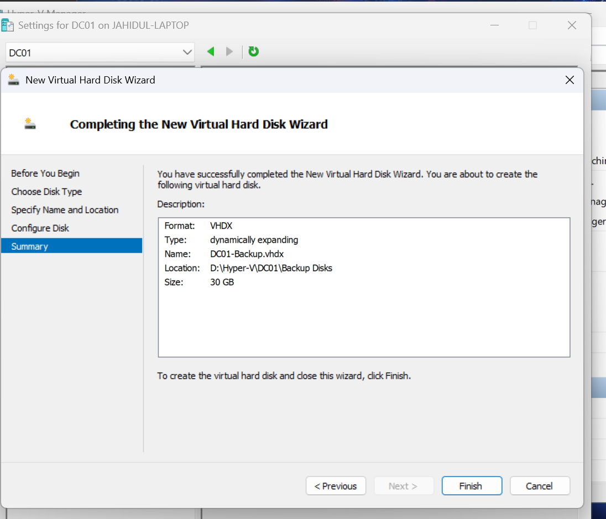

After the VHDX was attached to `DC01`, Windows Server detected it as a new **30 GB unallocated disk**.

This confirmed that the additional virtual disk was successfully presented to the server before it was initialized and formatted.

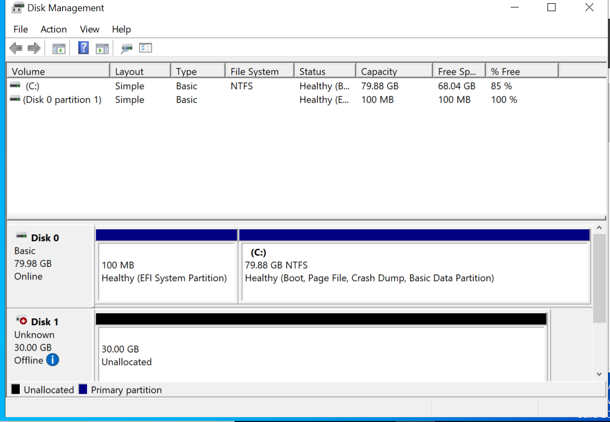

The new disk was initialized using GPT, formatted with NTFS, assigned drive letter `D:`, and labelled **DC01 Backup**.

The completed volume was approximately 30 GB and ready to be used as the backup destination.

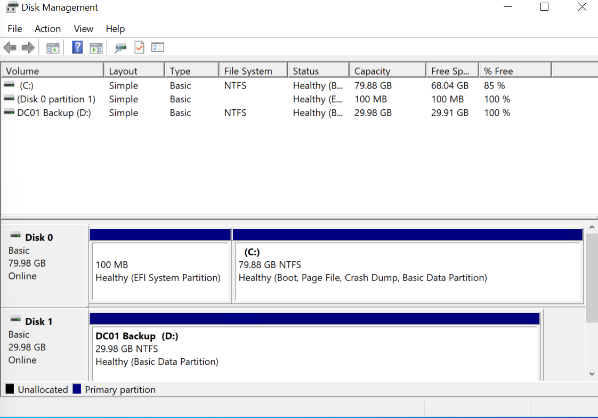

---

## 2. Windows Server Backup Installation and Configuration

The **Windows Server Backup** feature was installed on `DC01` through Server Manager using the **Add Roles and Features Wizard**.

This provides Microsoft's built-in tools for performing and managing server backups and recovery operations.

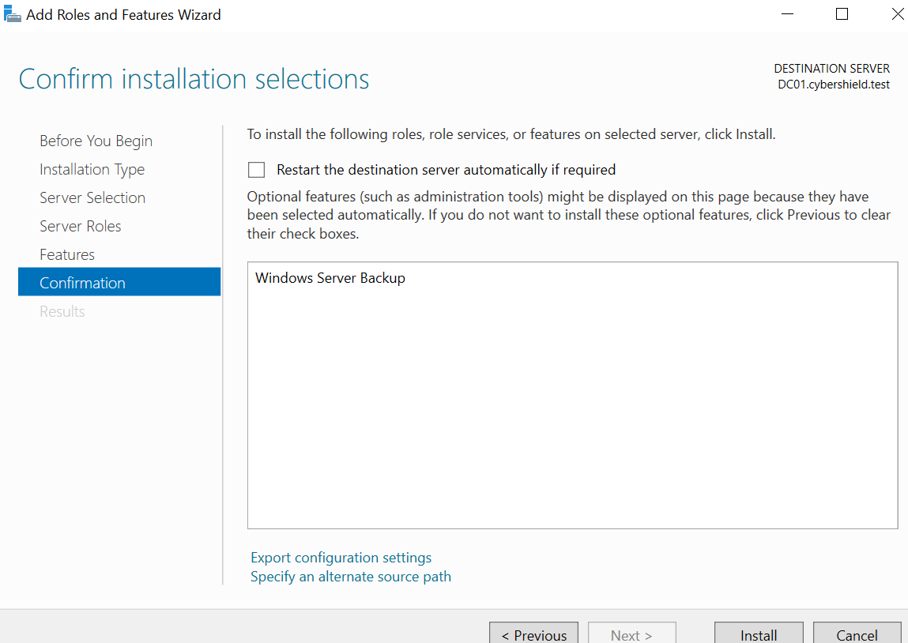

### Selecting Departmental Data

A custom backup was configured to protect the departmental data stored in:

```text
C:\CyberShield-Data
```

This location contains the departmental folders used throughout the lab, including IT, HR, Finance, and Sales.

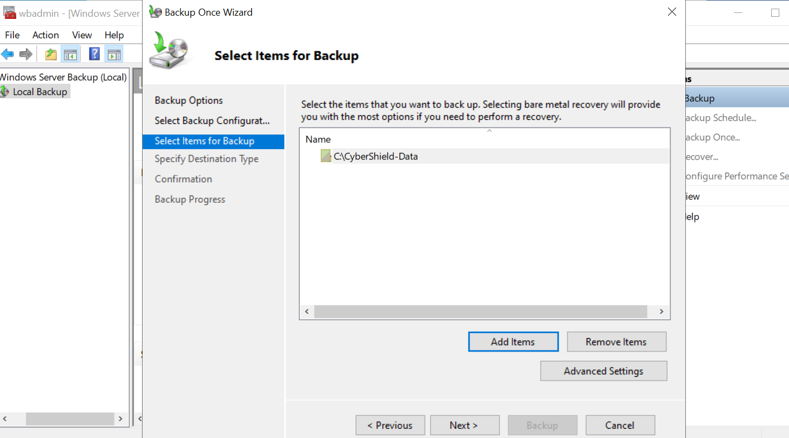

### Selecting the Backup Destination

The dedicated `DC01 Backup (D:)` volume was selected as the backup destination.

Keeping the backup on a separate disk from the source data demonstrates the basic principle of separating production data from its backup copy.

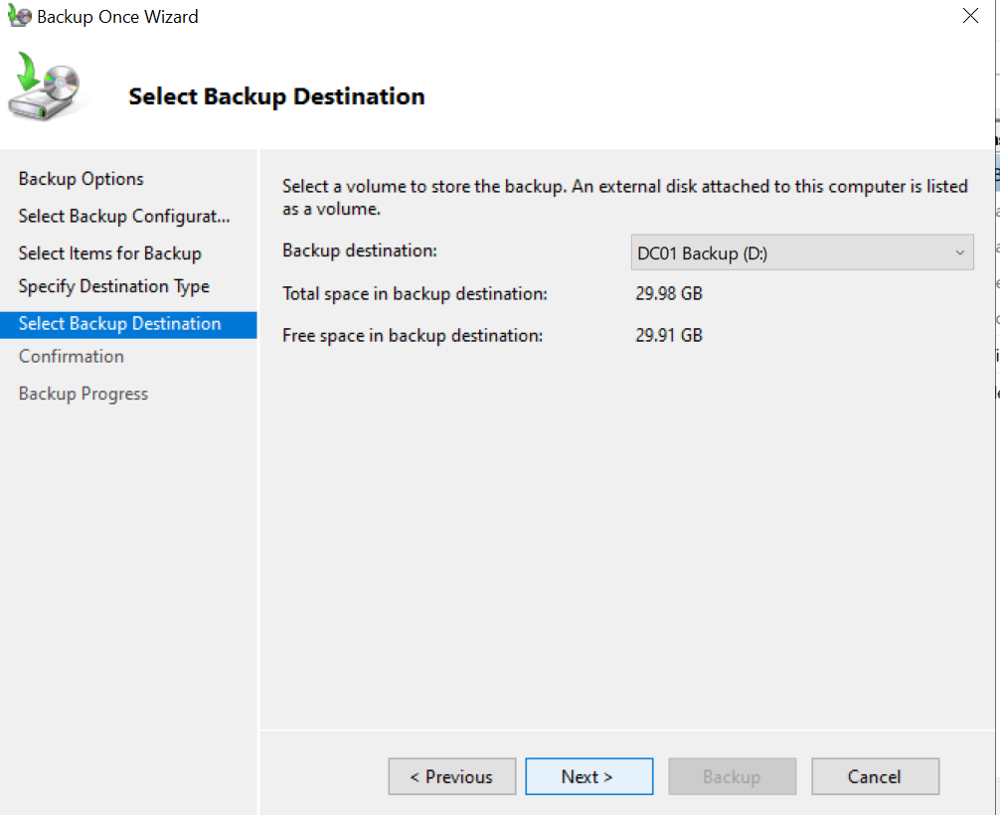

---

## 3. Backup and Accidental File Deletion Test

To verify that the backup could be used for an actual recovery, a test file named:

```text
Backup-Recovery-Test.txt
```

was created inside the IT departmental folder:

```text
C:\CyberShield-Data\IT
```

The document contained test data specifically created for the backup and recovery exercise.

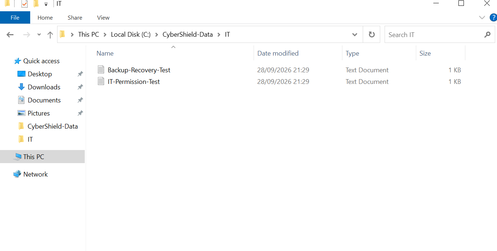

### Successful Backup

A manual backup of `C:\CyberShield-Data` was then performed using Windows Server Backup.

The backup completed successfully and was stored on the dedicated `DC01 Backup (D:)` volume.

This created a recovery point containing the test file before the simulated data-loss event.

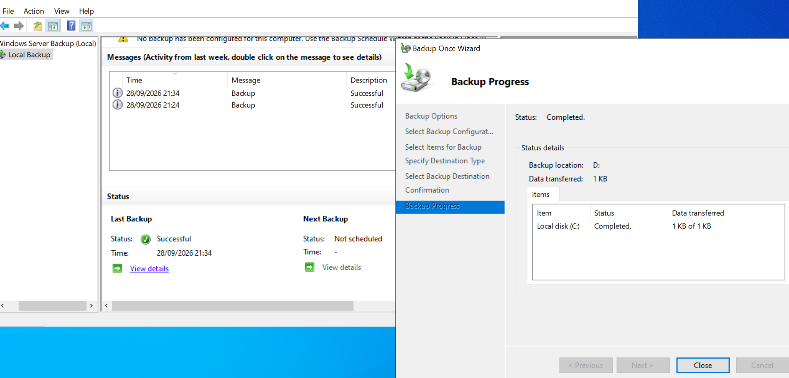

### Simulating Accidental File Deletion

To simulate a common IT support recovery scenario, `Backup-Recovery-Test.txt` was deliberately deleted from the live IT departmental folder.

The existing `IT-Permission-Test` file remained in place, confirming that only the recovery test file had been removed.

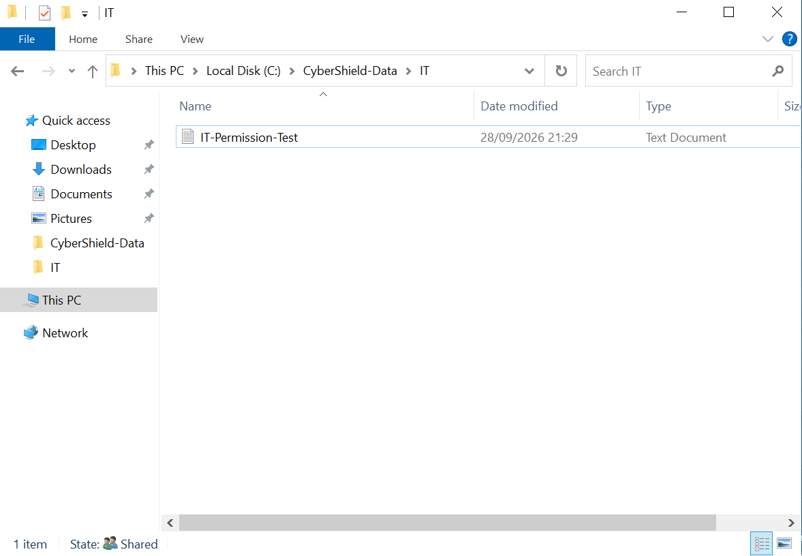

At this stage, the file no longer existed in the live departmental data but remained available within the Windows Server backup.

---

## 4. File Recovery and Verification

Windows Server Backup was used to recover the deliberately deleted test file.

### Selecting the Recovery Point

The **Recovery Wizard** identified the available backup stored on `DC01 Backup (D:)`.

The most recent successful backup was selected because it contained `Backup-Recovery-Test.txt` before the file was deleted.

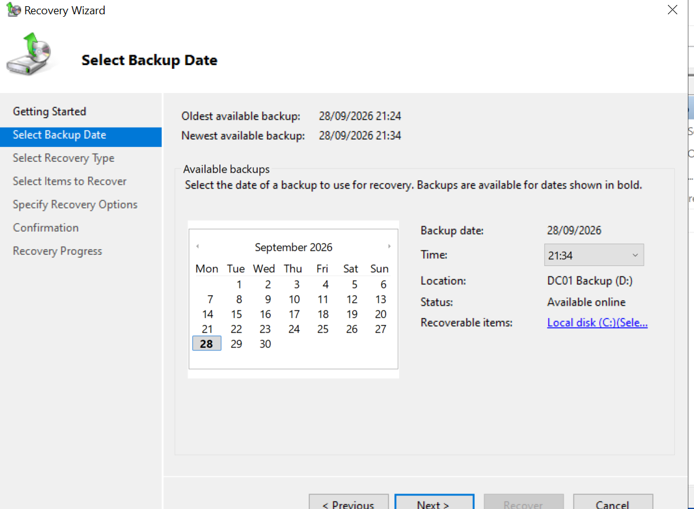

### Locating the Deleted File

Using the **Files and folders** recovery option, the backup was browsed to:

```text
C:\CyberShield-Data\IT
```

`Backup-Recovery-Test.txt` was visible inside the backup even though it had already been deleted from the live departmental folder.

This confirmed that the required file was available for recovery.

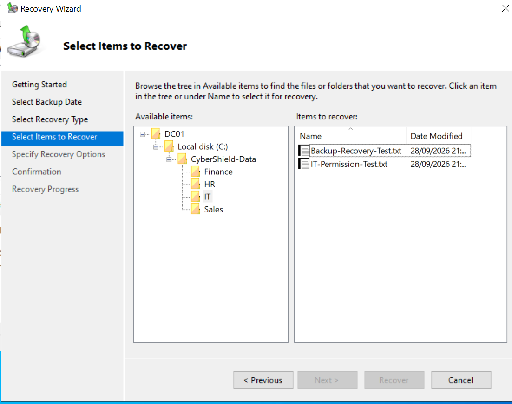

### Recovery Verification

The file was restored to its original location:

```text
C:\CyberShield-Data\IT
```

After the recovery operation completed, File Explorer was used to verify that `Backup-Recovery-Test.txt` had successfully returned alongside the existing IT departmental file.

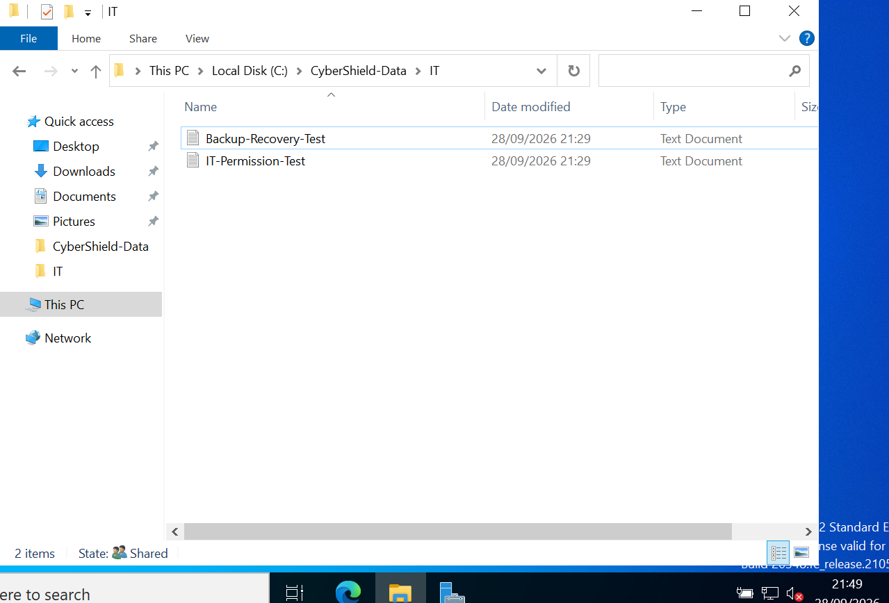

The recovery test was successful, demonstrating that the backup was not only created successfully but could also be used to restore deleted data.

---

## 5. Validation and Learning Outcome

The backup and recovery exercise was successfully completed on `DC01`.

The completed workflow demonstrated:

- Creating and attaching a dedicated backup VHDX in Hyper-V
- Initializing and formatting a new Windows Server volume
- Installing the Windows Server Backup feature
- Configuring a custom backup of departmental data
- Using a separate disk as the backup destination
- Verifying successful backup completion
- Simulating accidental deletion of a business file
- Selecting an appropriate recovery point
- Browsing backed-up files using the Recovery Wizard
- Restoring a deleted file to its original location
- Verifying that the recovered file was successfully returned

## Backup and Recovery Lessons

This exercise demonstrated an important principle of system administration: **a backup should be tested by performing a recovery**.

Successfully completing a backup job confirms that data was copied, but performing a restore provides stronger evidence that the protected data can actually be recovered when required.

The lab also demonstrated the importance of separating backup storage from the original data. The dedicated virtual backup disk provides this separation for learning purposes, while a production environment would typically extend this approach with additional backup infrastructure, retention policies, and off-site or cloud-based copies.

The completed recovery test demonstrates a practical workflow that could be used by IT support or system administration teams when responding to accidental file deletion or data-loss incidents.

